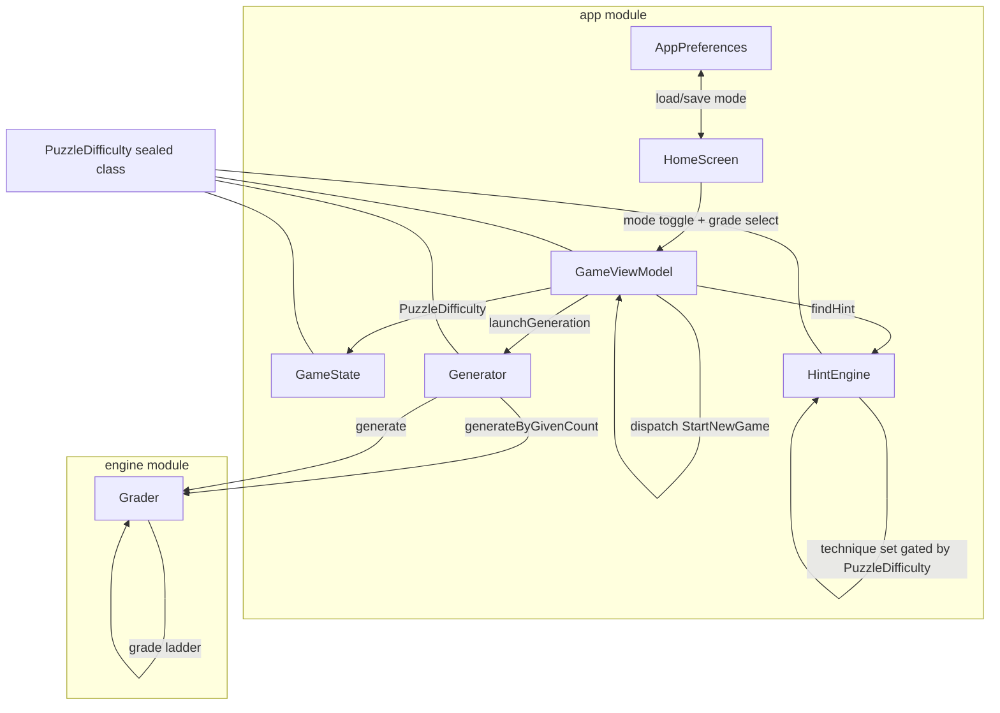
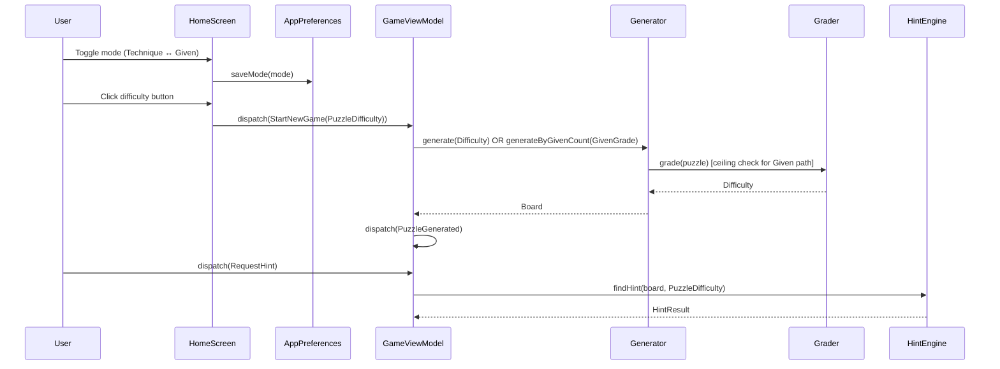

# Design: difficulty-modes

## Overview

Introduce a `PuzzleDifficulty` sealed class that wraps either technique-based grading (existing `Difficulty` enum) or given-count-based grading (new `GivenGrade` enum). Generator gains a `generateByGivenCount` path; Grader gains Naked Triples, Hidden Triples, and Swordfish to extend its technique ladder; HintEngine dispatches technique sets per mode; HomeScreen adds a mode toggle persisted in AppPreferences.

---

## Architecture



---

## Components

### PuzzleDifficulty (new — engine module)

**Purpose**: Union type for the two difficulty modes. Replaces bare `Difficulty` at every public boundary.

```kotlin
// engine/src/main/kotlin/sudoku/engine/PuzzleDifficulty.kt
package sudoku.engine

sealed class PuzzleDifficulty {
    /** Grade determined by which solving techniques are needed. */
    data class Technique(val grade: Difficulty) : PuzzleDifficulty()

    /** Grade determined by how many givens the puzzle contains. */
    data class Given(val grade: GivenGrade) : PuzzleDifficulty()
}
```

### GivenGrade (new — engine module)

**Purpose**: Encodes given-count range and technique ceiling for Given-based mode.

```kotlin
// engine/src/main/kotlin/sudoku/engine/GivenGrade.kt
package sudoku.engine

enum class GivenGrade(
    val minGivens: Int,
    val maxGivens: Int,
    val techniqueCeiling: TechniqueCeiling,
) {
    EASY   (minGivens = 36, maxGivens = 45, techniqueCeiling = TechniqueCeiling.SINGLES),
    MEDIUM (minGivens = 29, maxGivens = 35, techniqueCeiling = TechniqueCeiling.SINGLES),
    HARD   (minGivens = 24, maxGivens = 28, techniqueCeiling = TechniqueCeiling.PAIRS),
    EXPERT (minGivens = 17, maxGivens = 23, techniqueCeiling = TechniqueCeiling.PAIRS),
}

enum class TechniqueCeiling { SINGLES, PAIRS }
```

`TechniqueCeiling` is used by Generator (ceiling check) and HintEngine (hint gating). Keeping it in the engine module avoids cross-module leakage.

### Grader (modify — engine module)

**Purpose**: Grade a puzzle by walking the technique ladder. Add Naked Triples, Hidden Triples between Pointing Pairs and X-Wing; add Swordfish after X-Wing. Redefine grade boundaries.

New ladder order:
1. Naked Singles
2. Hidden Singles → if solved: **EASY**
3. + Naked Pairs, Hidden Pairs → if solved: **MEDIUM**
4. + Pointing Pairs → if solved: **MEDIUM** (pointing pairs alone don't push to HARD)

Wait — per requirements: MEDIUM = solved by Pairs/Pointing Pairs (not Triples). HARD = requires Naked/Hidden Triples. So Pointing Pairs belong in the MEDIUM tier.

Revised ladder:

```
Tier 1: Naked Singles + Hidden Singles
  → solved: EASY

Tier 2: + Naked Pairs + Hidden Pairs + Pointing Pairs
  → solved: MEDIUM

Tier 3: + Naked Triples + Hidden Triples
  → solved: HARD

Tier 4: + X-Wing + Swordfish
  → solved or not: EXPERT (fall-through)
```

New methods to add:
```kotlin
internal fun applyNakedTriples(candidates: IntArray, digits: IntArray): Boolean
internal fun applyHiddenTriples(candidates: IntArray, digits: IntArray): Boolean
internal fun applySwordfish(candidates: IntArray, digits: IntArray): Boolean
```

**Impact on existing GraderTest**: The `hardPuzzle` reference puzzle currently grades as HARD via Pointing Pairs. Under the new ladder, Pointing Pairs move to Tier 2 (MEDIUM). The existing `hardPuzzle` may now grade as MEDIUM. A new reference puzzle that requires Naked/Hidden Triples must be identified and the test updated.

**Impact on ExternalPuzzleGraderTest**: Output labels will shift for puzzles that previously required Pointing Pairs (now MEDIUM) vs puzzles that required X-Wing (still EXPERT). The test only prints — no assertions — so it will not break, but output will change.

### Generator (modify — engine module)

**Purpose**: Add `generateByGivenCount(grade: GivenGrade): Board` alongside the existing `generate(difficulty: Difficulty)`.

```kotlin
suspend fun generate(difficulty: Difficulty): Board   // unchanged signature

suspend fun generateByGivenCount(grade: GivenGrade): Board
```

**generateByGivenCount algorithm**:

```
for attempt in 1..MAX_ATTEMPTS:
    solution = fillGrid() ?: continue          // existing Las Vegas fill
    puzzle = digHolesToTarget(solution, grade) ?: continue
    if ceilingExceeded(puzzle, grade):
        continue                                // bounded retry
    givens = BooleanArray(81) { puzzle[it] != 0 }
    return Board.fromDigits(puzzle, givens, solution)
throw IllegalStateException(...)
```

**digHolesToTarget(solution, grade): IntArray?**

Dig holes in random order. Stop when `puzzle.count { it == 0 } == 81 - targetGivens`, where `targetGivens` is sampled uniformly from `grade.minGivens..grade.maxGivens`. Each removal is accepted only if `Solver.countSolutions(puzzle, 2) == 1` (uniqueness). If uniqueness blocks us before reaching the target hole count, return `null`.

```kotlin
private fun digHolesToTarget(solution: IntArray, grade: GivenGrade): IntArray? {
    val puzzle = solution.copyOf()
    val target = (grade.minGivens..grade.maxGivens).random()
    val targetHoles = 81 - target
    val indices = (0..80).shuffled()
    var holes = 0
    for (idx in indices) {
        if (holes == targetHoles) break
        val saved = puzzle[idx]
        puzzle[idx] = 0
        if (Solver.countSolutions(puzzle, 2) != 1) {
            puzzle[idx] = saved
        } else {
            holes++
        }
    }
    return if (holes == targetHoles) puzzle else null
}
```

**ceilingExceeded(puzzle, grade): Boolean**

```kotlin
private fun ceilingExceeded(puzzle: IntArray, grade: GivenGrade): Boolean {
    // Run grader up to the ceiling; if puzzle is not solved at ceiling, ceiling exceeded
    return when (grade.techniqueCeiling) {
        TechniqueCeiling.SINGLES -> {
            val digits = puzzle.copyOf()
            val candidates = Grader.computeCandidates(digits)   // internal visibility (see note)
            // Inline while-loop matching the existing Grader idiom — no runTier helper
            var progressed = true
            while (progressed) {
                progressed = Grader.applyNakedSingles(candidates, digits)
                    || Grader.applyHiddenSingles(candidates, digits)
            }
            digits.any { it == 0 }                              // true = still unsolved = ceiling exceeded
        }
        TechniqueCeiling.PAIRS -> {
            val grade2 = Grader.grade(puzzle)
            grade2 == Difficulty.HARD || grade2 == Difficulty.EXPERT
        }
    }
}
```

`ceilingExceeded` is a private method on Generator. It reuses Grader logic via `internal` helpers.

> **Note — `Grader.computeCandidates` visibility**: `computeCandidates` is currently `private` in `Grader.kt`. It must be changed to `internal` so that `ceilingExceeded` (in Generator, same module) can call it. This change must be made in `Grader.kt` alongside the technique-ladder additions (Implementation Step 3). The `applyNakedSingles` and `applyHiddenSingles` methods are already `internal`.

For PAIRS ceiling: a puzzle that grades HARD or EXPERT requires techniques beyond pairs, so the ceiling is exceeded.

> **Ordering constraint**: The PAIRS branch of `ceilingExceeded` calls `Grader.grade(puzzle)`, which relies on the new 4-tier technique ladder. Implementation Step 3 (Grader changes) must be completed before Step 4 (Generator changes) for `ceilingExceeded` to produce correct results.

**Retry strategy**: `MAX_ATTEMPTS = 1000` (same as existing). Most attempts for EASY/MEDIUM will succeed quickly. EXPERT (17–23 givens) is rare and may need many attempts; the existing `@Disabled` test precedent shows this is acceptable.

### HintEngine (modify — engine module)

**Purpose**: Dispatch technique-set selection based on `PuzzleDifficulty`.

Change signature:
```kotlin
// Before
fun findHint(board: Board, difficulty: Difficulty): HintResult

// After
fun findHint(board: Board, difficulty: PuzzleDifficulty): HintResult
```

Dispatch logic:

```kotlin
fun findHint(board: Board, difficulty: PuzzleDifficulty): HintResult {
    val candidates = computeAllCandidates(board)
    return when (difficulty) {
        is PuzzleDifficulty.Technique -> findHintForTechnique(board, candidates, difficulty.grade)
        is PuzzleDifficulty.Given     -> findHintForGiven(board, candidates, difficulty.grade)
    }
}

private fun findHintForTechnique(board: Board, candidates: IntArray, grade: Difficulty): HintResult {
    // Existing logic: all techniques up to grade, gate beyond with NoHintForDifficulty
    val result = nakedSingle(board, candidates)
        ?: hiddenSingle(board, candidates)
        ?: nakedPair(board, candidates)
        ?: hiddenPair(board, candidates)
        ?: pointingPair(board, candidates)
        // NEW techniques for HARD/EXPERT technique-based
        ?: if (grade == Difficulty.HARD || grade == Difficulty.EXPERT)
               nakedTriple(board, candidates) ?: hiddenTriple(board, candidates)
           else null
        ?: if (grade == Difficulty.EXPERT)
               xWingHint(board, candidates) ?: swordfishHint(board, candidates)
           else null
    if (result != null) return result
    // Only return NoHintForDifficulty for technique-based modes that have a meaningful
    // ceiling (HARD and EXPERT). EASY/MEDIUM have no techniques above their tier that
    // could be offered, so return NoHint (preserves existing behaviour).
    return if (grade == Difficulty.HARD || grade == Difficulty.EXPERT)
        HintResult.NoHintForDifficulty
    else
        HintResult.NoHint
}

private fun findHintForGiven(board: Board, candidates: IntArray, grade: GivenGrade): HintResult {
    // Singles always available
    val singlesResult = nakedSingle(board, candidates) ?: hiddenSingle(board, candidates)
    if (singlesResult != null) return singlesResult

    // Pairs available for Hard/Expert given-based
    if (grade == GivenGrade.HARD || grade == GivenGrade.EXPERT) {
        val pairsResult = nakedPair(board, candidates)
            ?: hiddenPair(board, candidates)
            ?: pointingPair(board, candidates)
        if (pairsResult != null) return pairsResult
    }

    // Never suggest Triples, X-Wing, Swordfish for given-based
    // "no hint available" (not "no hint for difficulty")
    return HintResult.NoHint
}
```

Note: `HintResult.NoHintForDifficulty` is only returned for technique-based mode. For given-based, the ceiling means "no hint available" (US-3: "Show 'no hint available' (not 'no hint for difficulty') when at ceiling").

New hint methods to add to HintEngine:
```kotlin
private fun nakedTriple(board: Board, candidates: IntArray): HintResult.Found?
private fun hiddenTriple(board: Board, candidates: IntArray): HintResult.Found?
private fun xWingHint(board: Board, candidates: IntArray): HintResult.Found?
private fun swordfishHint(board: Board, candidates: IntArray): HintResult.Found?
```

#### New `HintExplanationData` subclasses

`HintResult.Found` requires a `HintExplanationData`. The existing subclasses (`Single`, `Pair`, `PointingPairRow`, `PointingPairCol`) do not cover triples or Swordfish. Add the following to `HintResult.kt`:

```kotlin
// In HintExplanationData sealed class:

/** Used by nakedTriple and hiddenTriple hints. */
data class Triple(
    val cell1: Int,
    val cell2: Int,
    val cell3: Int,
    val d1: Int,
    val d2: Int,
    val d3: Int,
) : HintExplanationData()

/** Used by swordfishHint. */
data class Swordfish(val digit: Int) : HintExplanationData()
```

`cell1/cell2/cell3` are cell indices (0–80) matching the convention used by `HintResult.Found.targetCells`. `d1/d2/d3` are the three confined digits. `HintBanner.kt` must be updated to render these new variants (see File Structure).

### GameState (modify — app module)

Fields that change type from `Difficulty` to `PuzzleDifficulty`:

| Field | Before | After |
|-------|--------|-------|
| `difficulty` | `Difficulty` | `PuzzleDifficulty` |
| `pendingDifficulty` | `Difficulty?` | `PuzzleDifficulty?` |
| `newGameTargetDifficulty` | `Difficulty?` | `PuzzleDifficulty?` |

`GameState.Initial` companion:
```kotlin
difficulty = PuzzleDifficulty.Technique(Difficulty.EASY),
pendingDifficulty = null,
newGameTargetDifficulty = null,
```

`equals()` comparison for `difficulty` / `pendingDifficulty` / `newGameTargetDifficulty` is structural (data class), no change needed.

### GameIntent (modify — app module)

```kotlin
// Before
data class StartNewGame(val difficulty: Difficulty) : GameIntent()

// After
data class StartNewGame(val difficulty: PuzzleDifficulty) : GameIntent()
```

No other intents reference `Difficulty` directly.

### GameViewModel (modify — app module)

**launchGeneration** changes:
```kotlin
private fun launchGeneration(difficulty: PuzzleDifficulty) {
    generationJob?.cancel()
    generationJob = coroutineScope.launch {
        try {
            val board = withContext(Dispatchers.Default) {
                when (difficulty) {
                    is PuzzleDifficulty.Technique -> Generator.generate(difficulty.grade)
                    is PuzzleDifficulty.Given     -> Generator.generateByGivenCount(difficulty.grade)
                }
            }
            dispatch(GameIntent.PuzzleGenerated(board))
        } catch (e: CancellationException) { throw e }
          catch (e: Exception) {
              _state.update { it.copy(isLoading = false, pendingDifficulty = null) }
          }
    }
}
```

**RequestHint** reduce — pass `PuzzleDifficulty` directly (no cast needed since `state.difficulty` is already `PuzzleDifficulty`):
```kotlin
val hint = HintEngine.findHint(board, state.difficulty)
```

**handleSideEffects** — `StartNewGame` carries `PuzzleDifficulty` now, already flows through to `launchGeneration`.

### HomeScreen (modify — app module)

**Mode toggle**: A `TabRow` or `Row` of two `TextButton`s (Technique / Given) at the top of the difficulty grid. The selected mode is lifted to a `selectedMode: DifficultyMode` parameter (or read from `AppPreferences` on first composition).

```kotlin
// New enum in app module (or reuse sealed class directly — keep simple)
// app/src/main/kotlin/sudoku/app/ui/DifficultyMode.kt
enum class DifficultyMode { TECHNIQUE, GIVEN }
```

Signature change:
```kotlin
@Composable
fun HomeScreen(
    onDifficultySelected: (PuzzleDifficulty) -> Unit,
    currentMode: DifficultyMode,
    onModeChange: (DifficultyMode) -> Unit,
    currentLocale: AppLocale,
    onLocaleChange: (AppLocale) -> Unit,
)
```

The four difficulty buttons produce either:
- `PuzzleDifficulty.Technique(Difficulty.EASY/MEDIUM/HARD/EXPERT)` when mode = TECHNIQUE
- `PuzzleDifficulty.Given(GivenGrade.EASY/MEDIUM/HARD/EXPERT)` when mode = GIVEN

Strings for the toggle buttons come from `Strings` interface (new keys, see below).

**Mode persistence**: Caller (App.kt / main composition) loads mode from `AppPreferences.loadMode()` on startup and saves on change.

### AppPreferences (modify — app module)

Add mode persistence alongside existing locale persistence:

```kotlin
private const val KEY_MODE = "difficulty_mode"

fun loadMode(): DifficultyMode =
    try { DifficultyMode.valueOf(prefs.get(KEY_MODE, DifficultyMode.TECHNIQUE.name)) }
    catch (e: Exception) { DifficultyMode.TECHNIQUE }

fun saveMode(mode: DifficultyMode) {
    try { prefs.put(KEY_MODE, mode.name) }
    catch (e: Exception) { System.err.println("AppPreferences: failed to save mode: ${e.message}") }
}
```

Default is `TECHNIQUE` (US-1: "Default: Technique-based on first launch").

---

## Data Flow



---

## Technical Decisions

| Decision | Options Considered | Choice | Rationale |
|----------|-------------------|--------|-----------|
| Type for difficulty union | `sealed class`, `typealias`, keep bare `Difficulty` | `sealed class PuzzleDifficulty` | Exhaustive `when`, zero ambiguity, matches user's interview decision |
| `GivenGrade` vs reuse `Difficulty` | Reuse `Difficulty`, new enum | New `GivenGrade` enum | Given ranges are separate domain from technique grades; coupling them invites misuse |
| `TechniqueCeiling` placement | In `GivenGrade`, separate file, in Generator | Separate enum in engine module | Used by both Generator and HintEngine; no circular dependency |
| Pointing Pairs tier in Grader | Keep in HARD tier, move to MEDIUM tier | Move to MEDIUM | Requirements explicitly: MEDIUM = Pairs/Pointing Pairs, HARD = Triples |
| Ceiling check for Given-based | Run full Grader, run partial Grader, custom check | Custom `ceilingExceeded` in Generator | Avoids exposing internal Grader state; fast partial run for SINGLES ceiling |
| `HintResult.NoHint` vs `NoHintForDifficulty` for Given ceiling | Both same, distinguish | `NoHint` for Given ceiling | US-3 explicit: show "no hint available", not "no hint for difficulty" |
| Mode toggle UI | `TabRow`, two `TextButton`s, `SegmentedButton` | Two `TextButton`s (existing pattern) | Consistent with existing locale toggle pattern; no new dependencies |
| `DifficultyMode` enum location | engine module, app module | app module | It's a UI/preference concept; engine only needs `GivenGrade` |
| `generateByGivenCount` signature vs FR-1 | `generateByGivenCount(targetGivens: Int, ceiling: TechniqueCeiling)` (as written in requirements), `generateByGivenCount(grade: GivenGrade)` | `generateByGivenCount(grade: GivenGrade)` | `GivenGrade` encapsulates both parameters; passing them separately makes it possible to supply a mismatched ceiling (e.g., SINGLES ceiling with 17-givens target). Single-argument form is impossible to misuse. |

---

## File Structure

| File | Action | Purpose |
|------|--------|---------|
| `engine/src/main/kotlin/sudoku/engine/PuzzleDifficulty.kt` | **Create** | Sealed class hierarchy |
| `engine/src/main/kotlin/sudoku/engine/GivenGrade.kt` | **Create** | Given-count ranges + technique ceiling enum |
| `engine/src/main/kotlin/sudoku/engine/Grader.kt` | **Modify** | Add applyNakedTriples, applyHiddenTriples, applySwordfish; restructure grade ladder; change `computeCandidates` from `private` to `internal` |
| `engine/src/main/kotlin/sudoku/engine/Generator.kt` | **Modify** | Add generateByGivenCount, digHolesToTarget, ceilingExceeded |
| `engine/src/main/kotlin/sudoku/engine/HintEngine.kt` | **Modify** | Change signature to PuzzleDifficulty; add nakedTriple, hiddenTriple, xWingHint, swordfishHint; dispatch by mode |
| `engine/src/main/kotlin/sudoku/engine/HintResult.kt` | **Modify** | Add `Triple` and `Swordfish` subclasses to `HintExplanationData` |
| `app/src/main/kotlin/sudoku/app/ui/components/HintBanner.kt` | **Modify** | Add rendering cases for `HintExplanationData.Triple` and `HintExplanationData.Swordfish` variants |
| `app/src/main/kotlin/sudoku/app/ui/DifficultyMode.kt` | **Create** | UI-layer enum for mode toggle |
| `app/src/main/kotlin/sudoku/app/state/GameState.kt` | **Modify** | difficulty, pendingDifficulty, newGameTargetDifficulty → PuzzleDifficulty |
| `app/src/main/kotlin/sudoku/app/state/GameIntent.kt` | **Modify** | StartNewGame.difficulty → PuzzleDifficulty |
| `app/src/main/kotlin/sudoku/app/state/GameViewModel.kt` | **Modify** | launchGeneration dispatch; RequestHint passes PuzzleDifficulty |
| `app/src/main/kotlin/sudoku/app/ui/HomeScreen.kt` | **Modify** | Add mode toggle; onDifficultySelected callback → PuzzleDifficulty |
| `app/src/main/kotlin/sudoku/app/ui/i18n/AppPreferences.kt` | **Modify** | Add loadMode/saveMode |
| `app/src/main/kotlin/sudoku/app/ui/i18n/Strings.kt` | **Modify** | New string keys |
| `app/src/main/kotlin/sudoku/app/ui/i18n/EnglishStrings.kt` | **Modify** | New string values |
| `app/src/main/kotlin/sudoku/app/ui/i18n/RussianStrings.kt` | **Modify** | New string values (Russian) |
| `engine/src/test/kotlin/sudoku/engine/GraderTest.kt` | **Modify** | Update hardPuzzle; add HARD-requires-triples assertion; add Swordfish/EXPERT test |
| `engine/src/test/kotlin/sudoku/engine/GeneratorTest.kt` | **Modify** | Add generateByGivenCount tests |
| `engine/src/test/kotlin/sudoku/engine/HintEngineTest.kt` | **Modify** | Add given-mode hint tests; add triple/swordfish hint tests |

---

## i18n Changes

New keys to add to `Strings` interface, `EnglishStrings`, and `RussianStrings`:

| Key | Type | English value | Purpose |
|-----|------|---------------|---------|
| `modeTechnique` | `String` | `"Technique"` | Toggle label |
| `modeGiven` | `String` | `"Given Count"` | Toggle label |
| `hintNakedTriple` | `String` | `"Naked Triple"` | Hint technique label |
| `hintHiddenTriple` | `String` | `"Hidden Triple"` | Hint technique label |
| `hintSwordfish` | `String` | `"Swordfish"` | Hint technique label |
| `hintExplainNakedTriple` | `(String, String, String, Int, Int, Int) -> String` | `"Naked Triple at $c1, $c2, $c3: digits $d1, $d2, $d3 confined here"` | Explanation |
| `hintExplainHiddenTriple` | `(String, String, String, Int, Int, Int) -> String` | `"Hidden Triple at $c1, $c2, $c3: digits $d1, $d2, $d3 confined to these cells"` | Explanation |
| `hintExplainSwordfish` | `(Int) -> String` | `"Swordfish: digit $digit eliminated from rows"` | Explanation |

`hintNoHint` already exists and maps to "No hint available" — reused for Given ceiling hit.

---

## Error Handling

| Scenario | Handling Strategy | User Impact |
|----------|-------------------|-------------|
| `generateByGivenCount` exhausts MAX_ATTEMPTS | Throws `IllegalStateException` caught by ViewModel | ViewModel sets `isLoading = false`, no puzzle shown; user sees loading spinner disappear |
| Uniqueness blocks target given count | `digHolesToTarget` returns null → retry next attempt | Transparent; retry loop handles it |
| Ceiling check fails every attempt | Same as MAX_ATTEMPTS exhaustion | Same as above |
| `AppPreferences.loadMode` parse error | Returns `DifficultyMode.TECHNIQUE` default | Silent fallback, user starts in Technique mode |

For UI error surface: when `isLoading` goes false but board is still empty (all-zero digits), the calling screen (HomeScreen is shown, not game screen) — ViewModel already returns to HomeScreen via existing navigation logic? Check: current code just sets `isLoading = false, pendingDifficulty = null`. No explicit failure state. A toast/snackbar for generation failure is out of scope for this spec.

---

## Edge Cases

- **Empty board in Given-mode Grader ceiling check**: Ceiling check only runs on puzzles produced by `digHolesToTarget` which guarantees unique solution. An all-zeros board cannot arise here.
- **Given-based EXPERT (17–23 givens) ceiling check**: These puzzles often need Pairs to solve, so `ceilingExceeded` with PAIRS ceiling returning `Grader.grade(puzzle) == HARD || EXPERT` — but a valid EXPERT given-based puzzle might grade as EASY or MEDIUM with the new Grader. That's fine: we only reject if it needs Triples or X-Wing/Swordfish (HARD or EXPERT grade). If it grades EASY or MEDIUM with 17-23 givens, it passes.
- **`HintResult.NoHintForDifficulty` in Given mode**: Never returned for Given mode. Existing UI code that displays `hintNoHintForDifficulty` string remains correct for Technique mode.
- **Pointing Pairs reclassification**: Existing `hardPuzzle` in GraderTest may now grade as MEDIUM. A new puzzle requiring Naked/Hidden Triples must replace it. The reference puzzles in `ExternalPuzzleGraderTest` (Master/Extreme samples) may now grade as HARD instead of EXPERT — acceptable, the test only prints.
- **Swordfish vs column-based X-Wing**: Swordfish is the 3-row generalisation of X-Wing. Implementation checks 3 rows each with candidate in ≤3 shared columns; eliminates from those columns outside the 3 rows. Symmetric column-based variant also needed.

---

## Test Strategy

### Existing tests that break

| Test | Why it breaks | Fix |
|------|--------------|-----|
| `GraderTest.known Hard puzzle grades as HARD` | Pointing Pairs now in MEDIUM tier; hardPuzzle (requires only Pointing Pairs) will grade MEDIUM | Replace `hardPuzzle` with a puzzle requiring Naked/Hidden Triples |
| `GeneratorTest.generated Hard board grades as HARD` | Same ladder shift — Generator still targets old HARD; generated puzzle may mismatch | May still pass if generated puzzle needs Triples; monitor and update |
| `HintEngineTest` (any test calling `findHint(board, Difficulty.*)` directly) | Signature changes to `PuzzleDifficulty` | Update call sites to `PuzzleDifficulty.Technique(Difficulty.*)` |
| `GameViewModelTest.kt` (`app/src/test/kotlin/sudoku/app/state/GameViewModelTest.kt`) referencing `GameState.difficulty: Difficulty` | Type change from `Difficulty` to `PuzzleDifficulty` | Update all references to wrap bare `Difficulty` values in `PuzzleDifficulty.Technique(...)`. Also check `app/src/test/kotlin/sudoku/app/ui/i18n/` tests (StringsCompletenessTest, LocaleResolverTest, AppPreferencesTest) for any indirect `Difficulty` usage. |

### New unit tests — engine module

**GraderTest additions**:
- `known Triples puzzle grades as HARD` — puzzle solvable by Naked/Hidden Triple, not by Pairs/PointingPairs
- `applyNakedTriples eliminates candidates` — unit test for the technique function
- `applyHiddenTriples eliminates candidates`
- `applySwordfish eliminates candidates`
- `known Swordfish puzzle grades as EXPERT`

**GeneratorTest additions**:
- `generateByGivenCount EASY produces givens in 36-45 range`
- `generateByGivenCount MEDIUM produces givens in 29-35 range`
- `generateByGivenCount HARD produces givens in 24-28 range`
- `generateByGivenCount board has exactly one solution`
- `generateByGivenCount EASY puzzle does not require Pairs` (ceiling check)
- `generateByGivenCount HARD puzzle does not require Triples or X-Wing`

**HintEngineTest additions**:
- `Given EASY mode returns NoHint when singles exhausted (not NoHintForDifficulty)`
- `Given HARD mode returns pair hint when singles exhausted`
- `Given EXPERT mode never returns triple hint`
- `Technique HARD mode returns triple hint when pairs exhausted`
- `Technique EXPERT mode returns swordfish hint`

### Integration / E2E
None required — this is a desktop app with no automated E2E framework in the codebase.

---

## Performance Considerations

- `generateByGivenCount` for EXPERT grade (17-23 givens) may retry many times. Existing precedent: Generator has `@Disabled` test for EXPERT technique-based for the same reason. Same pattern applies.
- Naked/Hidden Triples: O(n³) over unit cells (9 cells → 84 triples max per unit, 27 units = ~2268 checks per pass). Acceptable for a single solve pass.
- Swordfish: O(n³) over rows = 84 row triplets per digit × 9 digits = 756 checks. Acceptable.

## Security Considerations

None — local desktop app, no network, no user-supplied puzzle input (puzzles are generated internally).

---

## Existing Patterns to Follow

- `internal fun apply*(candidates: IntArray, digits: IntArray): Boolean` — technique function signature in Grader
- `object` for stateless engine singletons (Grader, HintEngine, Generator)
- `MAX_ATTEMPTS = 1000` retry bound in Generator
- `Preferences.userRoot().node("sudoku/app")` for persistence in AppPreferences
- `TextButton` + `alpha()` modifier for locale toggle in HomeScreen — reuse for mode toggle
- `runBlocking` in engine tests
- `@Disabled` for slow generation tests
- `coroutineScope.launch { withContext(Dispatchers.Default) { ... } }` for async generation in ViewModel

---

## Unresolved Questions

- Should a `DifficultyMode` mismatch with existing saved games (e.g., user switches mode mid-session) reset the game or preserve it? Current design: mode only takes effect on next `StartNewGame`.
- Should the HomeScreen display given-count ranges to the user (e.g., "Easy: 36-45 givens")? Not specified in requirements; omit for now.

---

## Implementation Steps

1. Create `engine/.../PuzzleDifficulty.kt` (sealed class)
2. Create `engine/.../GivenGrade.kt` (enum with ranges + TechniqueCeiling)
3. Modify `Grader.kt`: add `applyNakedTriples`, `applyHiddenTriples`, `applySwordfish`; restructure grade ladder to new 4-tier boundary (Pointing Pairs → MEDIUM; Triples → HARD; X-Wing/Swordfish → EXPERT)
4. Modify `Generator.kt`: add `generateByGivenCount`, `digHolesToTarget`, `ceilingExceeded`
5. Modify `HintEngine.kt`: change `findHint` signature to `PuzzleDifficulty`; add `findHintForTechnique`, `findHintForGiven`; add `nakedTriple`, `hiddenTriple`, `xWingHint`, `swordfishHint` private methods
6. Modify `GameState.kt`: change `difficulty`, `pendingDifficulty`, `newGameTargetDifficulty` to `PuzzleDifficulty` types; update `Initial`
7. Modify `GameIntent.kt`: `StartNewGame.difficulty` → `PuzzleDifficulty`
8. Modify `GameViewModel.kt`: update `launchGeneration` dispatch; `RequestHint` — no change needed (state.difficulty already PuzzleDifficulty)
9. Create `app/.../DifficultyMode.kt` enum
10. Modify `AppPreferences.kt`: add `loadMode` / `saveMode`
11. Modify `HomeScreen.kt`: add `currentMode`/`onModeChange` params; add mode toggle UI; emit `PuzzleDifficulty` from buttons
12. Modify `Strings.kt`, `EnglishStrings.kt`, `RussianStrings.kt`: add new i18n keys
13. Update `GraderTest.kt`: replace hardPuzzle; add Triple/Swordfish tests
14. Update `GeneratorTest.kt`: add `generateByGivenCount` tests
15. Update `HintEngineTest.kt`: migrate signature; add given-mode and triple tests