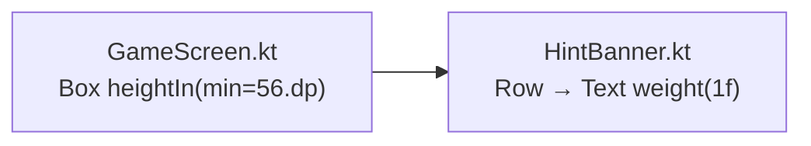

# Design: Fix Hint Text Overflow

## Overview

Two surgical Compose modifier changes fix hint text clipping. `weight(1f)` lets the explanation `Text` fill remaining `Row` width and wrap correctly; `heightIn(min = 56.dp)` replaces the exact-height constraint so the container grows with the content.

## Architecture

No new components. Two targeted edits to existing composables.



## Components

### Change 1 — HintBanner.kt (line 52)

**Problem**: Both `Text` composables in the `Row` are unbounded. The explanation `Text` cannot calculate available width, so it never wraps — it overflows or gets clipped.

**Fix**: Add `modifier = Modifier.weight(1f)` to the explanation `Text`.

```kotlin
// Before
Text(text = explanationText)

// After
Text(text = explanationText, modifier = Modifier.weight(1f))
```

`weight(1f)` allocates all remaining `Row` width (after the technique name `Text`) to the explanation, enabling proper multi-line wrapping.

---

### Change 2 — GameScreen.kt (line 173)

**Problem**: `height(56.dp)` is an exact constraint. When the explanation wraps to a second line, the `Box` does not grow and the overflow is clipped.

**Fix**: Replace `height(56.dp)` with `heightIn(min = 56.dp)`.

```kotlin
// Before
Box(modifier = Modifier.fillMaxWidth().height(56.dp))

// After
Box(modifier = Modifier.fillMaxWidth().heightIn(min = 56.dp))
```

`heightIn(min = 56.dp)` preserves the stable 56 dp slot for single-line hints and allows the container to grow when content is taller.

## Technical Decisions

| Decision | Options | Choice | Rationale |
|----------|---------|--------|-----------|
| Weight value | 0.5f, 1f | `1f` | Technique name `Text` has no weight, so `1f` gives all remaining space to explanation |
| Height constraint | `wrapContentHeight`, `heightIn(min)` | `heightIn(min = 56.dp)` | Preserves minimum height for single-line hints; no layout shift |
| Scope of change | Refactor composable vs. targeted edit | Targeted edit | Requirements mandate max 2 files, no style changes |

## File Structure

| File | Action | Change |
|------|--------|--------|
| `app/src/main/kotlin/sudoku/app/ui/components/HintBanner.kt` | Modify | Add `modifier = Modifier.weight(1f)` at line 52 |
| `app/src/main/kotlin/sudoku/app/ui/GameScreen.kt` | Modify | Replace `height(56.dp)` with `heightIn(min = 56.dp)` at line 173 |

## Verification Steps

1. **Build gate**: `./gradlew assembleDebug` exits 0.
2. **Grep AC-1**: `grep -c "heightIn" app/src/main/kotlin/sudoku/app/ui/GameScreen.kt` returns `1`.
3. **Grep AC-2**: `grep -c "weight(1f)" app/src/main/kotlin/sudoku/app/ui/components/HintBanner.kt` returns `1`.
4. **Diff check**: `git diff --name-only` shows exactly `HintBanner.kt` and `GameScreen.kt`.
5. **Manual — long hint**: Launch app, trigger PointingPairCol hint in EN and RU; confirm full explanation text visible, no clipping.
6. **Manual — short hint**: Trigger NakedSingle hint; confirm hint slot renders at ~56 dp with no layout shift.

## Implementation Steps

1. Edit `HintBanner.kt` line 52: add `modifier = Modifier.weight(1f)` to the explanation `Text`.
2. Edit `GameScreen.kt` line 173: replace `.height(56.dp)` with `.heightIn(min = 56.dp)`.
3. Run `./gradlew assembleDebug` to confirm no compile errors.
4. Verify grep counts and diff surface area match AC requirements.
