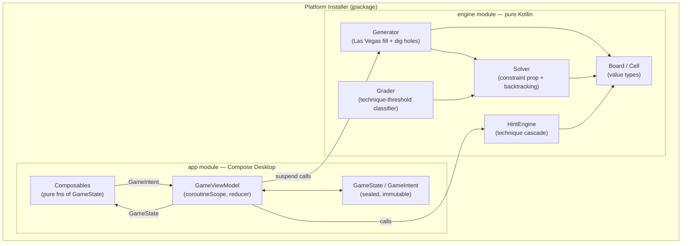
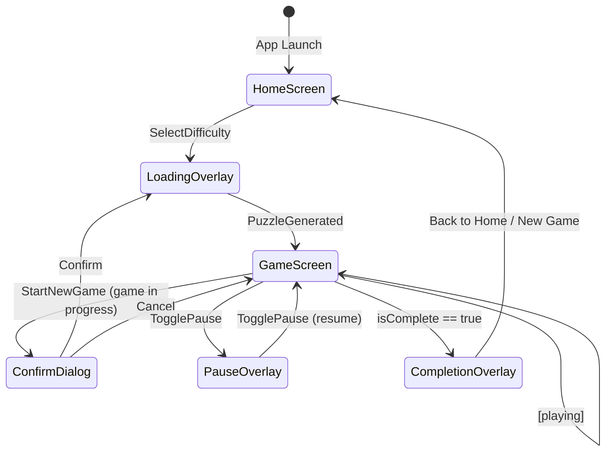

# Design: Sudoku Desktop App

## Overview

A Kotlin + Compose Multiplatform Desktop application structured as two Gradle modules: `engine` (pure Kotlin, zero external dependencies, fully unit-testable in isolation) and `app` (Compose Desktop UI + MVI state layer). The engine encapsulates all Sudoku logic — generation, solving, grading, hint resolution — as pure functions operating on value types. The app module wires a single `GameViewModel` to Compose composables via unidirectional MVI: composables observe a single immutable `GameState` and emit `GameIntent` values; the ViewModel reduces intents into new state and drives coroutines for async generation and the timer.

Distribution targets Windows (.exe/.msi), macOS (.dmg), and Linux (.deb) via `jpackage` with a bundled JRE — no JRE required on end-user machines. Each platform installer is built independently in a GitHub Actions CI matrix.

---

## Architecture



---

## Module Structure

### File Tree

```
sudoku/
├── settings.gradle.kts
├── gradle/
│   └── libs.versions.toml
├── engine/
│   ├── build.gradle.kts
│   └── src/
│       ├── main/kotlin/sudoku/engine/
│       │   ├── Board.kt
│       │   ├── Cell.kt
│       │   ├── Difficulty.kt
│       │   ├── Generator.kt
│       │   ├── Solver.kt
│       │   ├── Grader.kt
│       │   ├── HintEngine.kt
│       │   └── HintResult.kt
│       └── test/kotlin/sudoku/engine/
│           ├── BoardTest.kt
│           ├── GeneratorTest.kt
│           ├── SolverTest.kt
│           ├── GraderTest.kt
│           └── HintEngineTest.kt
└── app/
    ├── build.gradle.kts
    └── src/
        └── main/kotlin/sudoku/app/
            ├── Main.kt
            ├── state/
            │   ├── GameState.kt
            │   ├── GameIntent.kt
            │   └── GameViewModel.kt
            └── ui/
                ├── App.kt
                ├── HomeScreen.kt
                ├── GameScreen.kt
                └── components/
                    ├── SudokuBoard.kt
                    ├── NumberPad.kt
                    ├── TimerDisplay.kt
                    ├── HintBanner.kt
                    ├── CompletionOverlay.kt
                    └── PauseOverlay.kt
```

### Gradle Build Files

**settings.gradle.kts**
```kotlin
rootProject.name = "sudoku"
include(":engine", ":app")
```

**engine/build.gradle.kts**
```kotlin
plugins {
    kotlin("jvm") version "2.0.21"
}

kotlin {
    jvmToolchain(21)
}

dependencies {
    testImplementation(kotlin("test"))
    testImplementation("org.junit.jupiter:junit-jupiter:5.11.0")
}

tasks.test {
    useJUnitPlatform()
}
```

**app/build.gradle.kts**
```kotlin
plugins {
    kotlin("jvm") version "2.0.21"
    id("org.jetbrains.compose") version "1.7.3"
    id("org.jetbrains.kotlin.plugin.compose") version "2.0.21"
}

kotlin {
    jvmToolchain(21)
}

dependencies {
    implementation(project(":engine"))
    implementation(compose.desktop.currentOs)
    implementation("org.jetbrains.kotlinx:kotlinx-coroutines-core:1.9.0")
    implementation("org.jetbrains.kotlinx:kotlinx-coroutines-swing:1.9.0")
}

compose.desktop {
    application {
        mainClass = "sudoku.app.MainKt"
        nativeDistributions {
            targetFormats(
                org.jetbrains.compose.desktop.application.dsl.TargetFormat.Dmg,
                org.jetbrains.compose.desktop.application.dsl.TargetFormat.Msi,
                org.jetbrains.compose.desktop.application.dsl.TargetFormat.Deb
            )
            packageName = "Sudoku"
            packageVersion = "1.0.0"
            description = "Sudoku puzzle game"
            windows {
                menuGroup = "Sudoku"
                upgradeUuid = "a1b2c3d4-e5f6-7890-abcd-ef1234567890"
            }
            macOS {
                bundleID = "com.sudoku.app"
            }
            linux {
                packageName = "sudoku"
            }
        }
    }
}
```

**gradle/libs.versions.toml**
```toml
[versions]
kotlin = "2.0.21"
compose = "1.7.3"
coroutines = "1.9.0"
junit = "5.11.0"

[libraries]
coroutines-core = { module = "org.jetbrains.kotlinx:kotlinx-coroutines-core", version.ref = "coroutines" }
coroutines-swing = { module = "org.jetbrains.kotlinx:kotlinx-coroutines-swing", version.ref = "coroutines" }
junit-jupiter = { module = "org.junit.jupiter:junit-jupiter", version.ref = "junit" }

[plugins]
kotlin-jvm = { id = "org.jetbrains.kotlin.jvm", version.ref = "kotlin" }
compose = { id = "org.jetbrains.compose", version.ref = "compose" }
compose-compiler = { id = "org.jetbrains.kotlin.plugin.compose", version.ref = "kotlin" }
```

---

## Engine Module Design

### Board Model

```kotlin
// Cell.kt
// Cell index convention: index = row * 9 + col  (0..80)
// row = index / 9, col = index % 9, box = (row/3)*3 + (col/3)

data class Cell(
    val index: Int,        // 0..80
    val digit: Int,        // 0 = empty, 1–9 = filled
    val isGiven: Boolean,
)

val Int.row: Int get() = this / 9
val Int.col: Int get() = this % 9
val Int.box: Int get() = (this / 9 / 3) * 3 + (this % 9 / 3)

fun peersOf(index: Int): IntArray  // cached — 20 peers per cell
```

```kotlin
// Board.kt
// Flat IntArray(81) is the primary representation.
// 0 = empty, 1–9 = filled.
// Candidates stored as IntArray(81) where each element is a bitmask:
//   bit i set (1 shl i, i in 1..9) means digit i is a candidate.
// Givens tracked as BooleanArray(81).

class Board private constructor(
    val digits: IntArray,       // size 81, copied on mutation
    val givens: BooleanArray,   // size 81, immutable after construction
    val candidates: IntArray,   // size 81, bitmask per cell
) {
    companion object {
        fun fromDigits(digits: IntArray, givens: BooleanArray): Board
        fun empty(): Board
    }

    fun withDigit(index: Int, digit: Int): Board   // returns new Board
    fun withErased(index: Int): Board              // returns new Board
    val isEmpty: Boolean get() = digits.all { it == 0 }
    val isFull:  Boolean get() = digits.none { it == 0 }
}
```

**Candidate bitmask convention**: bit `i` (1-based, `1 shl i`) set = digit `i` is a candidate. Digit 0 has no meaning in candidate context.

**Peer lookup**: Pre-computed at module initialization as `val PEERS: Array<IntArray>` — array of 81 entries each containing the 20 peer cell indices for that cell. This is a module-level constant (computed once, used throughout engine and hint engine).

---

### Difficulty Enum

```kotlin
// Difficulty.kt
enum class Difficulty {
    EASY,    // solvable by Naked Single + Hidden Single only
    MEDIUM,  // requires Naked Pair or Hidden Pair; stalls without them
    HARD,    // requires Pointing Pair; stalls on Medium techniques
    EXPERT;  // requires X-Wing or stronger; stalls on Hard techniques
}
```

**Technique thresholds** (FR-003 – FR-007):

| Difficulty | Techniques used by grading solver | Behaviour if still stalled |
|------------|-----------------------------------|---------------------------|
| Easy       | Naked Single, Hidden Single       | Try Medium |
| Medium     | + Naked Pair, Hidden Pair         | Try Hard |
| Hard       | + Pointing Pair                   | Try Expert |
| Expert     | + X-Wing (simplified)             | Grade = Expert |

A puzzle is classified at the **lowest** level whose technique set can fully solve it.

---

### Generator

```kotlin
// Generator.kt
object Generator {
    /** Returns a puzzle Board (givens set) at the requested difficulty. */
    suspend fun generate(difficulty: Difficulty): Board
}
```

Internal steps:

1. `fillGrid(): IntArray` — Las Vegas randomized backtracking on empty 9×9
2. `digHoles(solution: IntArray, difficulty: Difficulty): IntArray` — removes cells, checks uniqueness
3. Returns `Board.fromDigits(puzzle, givens)` where `givens[i] = puzzle[i] != 0`

The generator runs in a coroutine context (called via `withContext(Dispatchers.Default)` in the ViewModel). Generation loops internally if an extremely rare failure occurs (full grid fill fails to produce a gradable puzzle after N attempts).

---

### Solver

```kotlin
// Solver.kt
object Solver {
    /** Returns the unique solution, or null if board is invalid/unsolvable. */
    fun solve(board: Board): IntArray?

    /**
     * Counts solutions up to [limit]. Returns 0, 1, or 2 (capped).
     * Used by Generator for uniqueness checking — exits immediately on count == 2.
     */
    fun countSolutions(digits: IntArray, limit: Int = 2): Int
}
```

Implementation: constraint propagation (eliminate known digits from peers after each placement) combined with DFS backtracking on the cell with the fewest remaining candidates (MRV heuristic). The MRV heuristic dramatically reduces the search space and keeps uniqueness checks well under 50ms in practice.

---

### Grader / Classifier

```kotlin
// Grader.kt
object Grader {
    /** Returns the difficulty classification for a given puzzle. */
    fun grade(puzzle: IntArray): Difficulty
}
```

Algorithm: attempt to solve the puzzle using a technique-constrained human solver. Techniques are added incrementally:

1. Run solver with Naked Single + Hidden Single. If solved → `EASY`.
2. Add Naked Pair + Hidden Pair. If solved → `MEDIUM`.
3. Add Pointing Pair. If solved → `HARD`.
4. Add X-Wing. If solved → `EXPERT`. (If still unsolved, grade as `EXPERT` — v1 does not distinguish beyond X-Wing.)

The human solver used here is a separate, non-backtracking technique-application loop distinct from the backtracking `Solver` — it only makes deductions; it does not guess.

---

### HintEngine

```kotlin
// HintResult.kt
sealed class HintResult {
    /** A technique was found. */
    data class Found(
        val technique: String,          // "Naked Single", "Hidden Single", etc.
        val targetCells: List<Int>,     // cells the technique acts on (highlight primary)
        val peerCells: List<Int>,       // constraining cells (highlight secondary)
        val explanation: String,        // human-readable, e.g. "Naked Single at R3C5: only 7 fits"
    ) : HintResult()

    /** No supported technique can make progress. */
    object NoHint : HintResult()

    /**
     * No supported technique works AND the difficulty is Hard/Expert.
     * Displayed as "No hint available for this difficulty level".
     */
    object NoHintForDifficulty : HintResult()
}
```

```kotlin
// HintEngine.kt
object HintEngine {
    /**
     * Finds the simplest applicable technique on the current board state.
     * [difficulty] is used to decide between NoHint and NoHintForDifficulty.
     */
    fun findHint(board: Board, difficulty: Difficulty): HintResult
}
```

Technique cascade (in priority order):

1. **Naked Single** — a cell where only one candidate remains
2. **Hidden Single** — a digit that appears as a candidate in exactly one cell of a unit
3. **Naked Pair** — two cells in the same unit with exactly the same two candidates
4. **Hidden Pair** — two digits confined to exactly two cells in a unit
5. **Pointing Pair** — a candidate confined to one row/column within a box

If none of the above apply:
- Difficulty is EASY or MEDIUM → `HintResult.NoHint`
- Difficulty is HARD or EXPERT → `HintResult.NoHintForDifficulty`

(AC-9.4: if a Hard/Expert board happens to be resolvable by a supported technique, `Found` is returned — the distinction only applies when no supported technique works.)

---

## State Model (MVI)

### GameState

```kotlin
// GameState.kt
data class GameState(
    // Board data
    val digits: IntArray,               // size 81; 0 = empty, 1–9 = filled
    val givens: BooleanArray,           // size 81; true = pre-filled, immutable
    val conflictIndices: Set<Int>,      // indices of cells in conflict
    val selectedIndex: Int?,            // null = no selection
    val numberHighlightDigit: Int?,     // digit to highlight across board (null = none)

    // Hint
    val hintResult: HintResult?,        // null = no active hint

    // Undo / Redo — each entry is a complete digits snapshot
    val undoStack: List<IntArray>,      // newest at tail
    val redoStack: List<IntArray>,      // newest at tail

    // Timer
    val timerSeconds: Long,
    val isPaused: Boolean,

    // Game lifecycle
    val isComplete: Boolean,
    val difficulty: Difficulty,

    // Loading (while puzzle is being generated)
    val isLoading: Boolean,
    val pendingDifficulty: Difficulty?, // set while generating, null otherwise

    // New game confirmation dialog
    val showNewGameConfirmation: Boolean,
    val newGameTargetDifficulty: Difficulty?, // difficulty user wants to start

    // Quit confirmation dialog (AC-7.6)
    val showQuitConfirmation: Boolean,
) {
    companion object {
        val Initial = GameState(
            digits = IntArray(81),
            givens = BooleanArray(81),
            conflictIndices = emptySet(),
            selectedIndex = null,
            numberHighlightDigit = null,
            hintResult = null,
            undoStack = emptyList(),
            redoStack = emptyList(),
            timerSeconds = 0L,
            isPaused = false,
            isComplete = false,
            difficulty = Difficulty.EASY,
            isLoading = false,
            pendingDifficulty = null,
            showNewGameConfirmation = false,
            newGameTargetDifficulty = null,
            showQuitConfirmation = false,
        )
    }
}
```

Note: `IntArray` is mutable by nature; the contract is that no code outside `GameViewModel` mutates these arrays. All state transitions produce new `IntArray` copies. This avoids boxing overhead of `List<Int>` for the hot path (81 cells), while keeping state semantically immutable.

**`numberHighlightDigit` lifecycle** (set/cleared in reducer):
- Set to `digits[selectedIndex]` when `SelectCell` is dispatched and the cell is non-empty
- Set to `null` when `SelectCell` is dispatched and the selected cell is empty (digit == 0)
- Cleared to `null` on `DeselectCell`, `EnterDigit`, `EraseCell`, `RequestHint`, `TogglePause`
- Not changed by `TimerTick`, `PuzzleGenerated`, or game lifecycle intents

---

### GameIntent

```kotlin
// GameIntent.kt
sealed class GameIntent {
    // Navigation / lifecycle
    data class StartNewGame(val difficulty: Difficulty) : GameIntent()
    data object ConfirmNewGame : GameIntent()
    data object CancelNewGame : GameIntent()

    // Quit confirmation (AC-7.6)
    data object ShowQuitConfirmation : GameIntent()
    data object ConfirmQuit : GameIntent()
    data object CancelQuit : GameIntent()

    data class PuzzleGenerated(val board: Board) : GameIntent()  // internal, from coroutine

    // Cell interaction
    data class SelectCell(val index: Int) : GameIntent()
    data object DeselectCell : GameIntent()
    data class EnterDigit(val digit: Int) : GameIntent()   // 1–9
    data object EraseCell : GameIntent()

    // Undo / Redo
    data object Undo : GameIntent()
    data object Redo : GameIntent()

    // Hint
    data object RequestHint : GameIntent()

    // Timer
    data object TogglePause : GameIntent()
    data object TimerTick : GameIntent()                   // internal, from timer coroutine

    // Completion
    data object GameCompleted : GameIntent()               // internal, auto-fired
}
```

---

### GameViewModel

```kotlin
// GameViewModel.kt
class GameViewModel(
    private val coroutineScope: CoroutineScope,
) {
    private val _state = MutableStateFlow(GameState.Initial)
    val state: StateFlow<GameState> = _state.asStateFlow()

    private var timerJob: Job? = null
    private var generationJob: Job? = null

    fun dispatch(intent: GameIntent) {
        _state.update { current -> reduce(current, intent) }
        // Side effects handled after state update
        handleSideEffects(intent)
    }

    private fun reduce(state: GameState, intent: GameIntent): GameState { ... }

    private fun handleSideEffects(intent: GameIntent) {
        when (intent) {
            is GameIntent.StartNewGame -> launchGeneration(intent.difficulty)
            is GameIntent.TogglePause  -> syncTimer()
            is GameIntent.PuzzleGenerated -> startTimer()
            else -> {}
        }
    }

    private fun launchGeneration(difficulty: Difficulty) {
        generationJob?.cancel()
        generationJob = coroutineScope.launch {
            val board = withContext(Dispatchers.Default) {
                Generator.generate(difficulty)
            }
            dispatch(GameIntent.PuzzleGenerated(board))
        }
    }

    private fun startTimer() {
        timerJob?.cancel()
        timerJob = coroutineScope.launch {
            while (isActive) {
                delay(1_000)
                dispatch(GameIntent.TimerTick)
            }
        }
    }
}
```

`GameViewModel` is instantiated once at the `App` composable level and passed down. In Compose Desktop there is no AndroidX `ViewModel`; `rememberCoroutineScope()` or a `LaunchedEffect`-anchored scope at the root provides the lifetime-bound scope.

**Reduce purity**: `reduce()` is a pure function `(GameState, GameIntent) -> GameState`. Side effects (launching coroutines) happen outside of `reduce()`.

---

## UI Component Hierarchy

### Screen Flow



### HomeScreen

Layout: centered column with title + four difficulty buttons (Easy / Medium / Hard / Expert). Each button fires `GameIntent.StartNewGame(difficulty)`. No other controls.

### GameScreen

```
+------------------------------------------+
|  [New Game]     Sudoku     00:42 [Pause] |
|  [Undo] [Redo]              [Hint]       |
+------------------------------------------+
|                                          |
|           SudokuBoard (square)           |
|                                          |
+------------------------------------------+
|              NumberPad                   |
|  [1][2][3][4][5][6][7][8][9]  [Erase]   |
+------------------------------------------+
|              HintBanner                  |
|  "Hidden Single at R4C7: only 3 fits"   |
+------------------------------------------+
```

The board area fills the available horizontal space maintaining a 1:1 aspect ratio (`Modifier.aspectRatio(1f)`).

**Keyboard handler** is attached at `GameScreen` level via `onKeyEvent` modifier on the root focusable container.

### SudokuBoard Composable

**Decision: Canvas-based rendering** (not LazyVerticalGrid).

Rationale:
- Cells need simultaneous multi-state visual decoration (selection border, number highlight fill, conflict fill) with fine-grained control
- Grid lines (thick for box boundaries, thin for cell boundaries) are drawn as canvas primitives — much cleaner than trying to configure grid cell borders
- Aspect-ratio-correct scaling on window resize is trivial with a single `Canvas(modifier = Modifier.fillMaxSize().aspectRatio(1f))`
- Performance: 81 cells drawn as canvas paths is extremely fast; no recomposition on every keystroke, only redraws the canvas

**NFR-004 (≥30 fps)**: The 81-cell Canvas draw loop completes in under 1ms on any modern GPU; redraws are triggered only on `GameState` changes collected via `collectAsState()`, not on every frame. This leaves the full 33ms frame budget for Compose's compositor, satisfying the ≥30 fps requirement under normal interaction.

```kotlin
@Composable
fun SudokuBoard(
    state: GameState,
    onCellClick: (index: Int) -> Unit,
) {
    Canvas(
        modifier = Modifier
            .fillMaxWidth()
            .aspectRatio(1f)
            .pointerInput(Unit) { detectTapGestures { offset -> onCellClick(offsetToIndex(offset, size)) } }
    ) {
        val cellSize = size.width / 9f
        drawGrid(cellSize)
        drawCells(state, cellSize)
        drawDigits(state, cellSize)
    }
}
```

**Cell rendering — three simultaneous visual states (NFR-012)**:

All three states are rendered additively on different layers in the canvas draw loop:

| State | Fill Color | Border / Outline | Additional Cue |
|-------|------------|-----------------|---------------|
| Selected | Blue tint (#C5D8FF) | **3dp solid blue border** (inside cell) | — |
| Number Match | Amber tint (#FFF3CD) | No extra border | Light crosshatch pattern overlay (thin diagonal lines at 20% opacity) |
| Conflict | Red tint (#FFCCCC) | **Dashed red outline** (2dp dash pattern) | — |

The border/outline variation satisfies NFR-012 (distinguishable beyond color alone). States can coexist on different cells simultaneously; a cell cannot logically be both selected and conflicting simultaneously in standard Sudoku play but the rendering layers are composable if needed.

**Draw order** per cell (back to front):
1. Background fill (normal = white/light-gray, given = slightly darker gray)
2. Number-match overlay (amber fill)
3. Conflict overlay (red fill)
4. Selected overlay (blue fill) — drawn last so selection is always visible
5. Digit text (given = bold dark, user = regular mid-gray)
6. Selection border
7. Conflict dashed border

**Grid lines**:
- Thin lines (0.5dp) between cells
- Thick lines (2dp) between 3×3 boxes

### NumberPad Composable

```kotlin
@Composable
fun NumberPad(
    onDigit: (Int) -> Unit,
    onErase: () -> Unit,
)
```

Row of 10 buttons (1–9 + Erase). Each button: minimum 48×48dp tap target. Uses `FlowRow` or `Row` with `weight(1f)` per button.

### TimerDisplay Composable

```kotlin
@Composable
fun TimerDisplay(seconds: Long, isPaused: Boolean)
```

Formats: `MM:SS` if `seconds < 3600`, `HH:MM:SS` otherwise. Shows "(Paused)" suffix when paused.

### HintBanner Composable

```kotlin
@Composable
fun HintBanner(hintResult: HintResult?)
```

Renders below the board. Visible only when `hintResult != null`. Dismissal is handled by the ViewModel — the banner disappears when the next `SelectCell` or `EnterDigit` intent clears `hintResult` in state.

| HintResult type | Display |
|-----------------|---------|
| `Found` | Technique name bold + explanation text |
| `NoHint` | "No hint available" |
| `NoHintForDifficulty` | "No hint available for this difficulty level" |
| `null` | Nothing (banner hidden) |

### CompletionOverlay Composable

Semi-transparent overlay (`Box` with `fillMaxSize()` background at 80% opacity) showing:
- "Puzzle Solved!"
- Difficulty label
- Elapsed time
- "New Game" button → `GameIntent.StartNewGame`
- "Back to Home" button → navigate to `HomeScreen`

### PauseOverlay Composable

Full-opacity overlay covering the board area only (not the toolbar). Renders "Game Paused" text and a "Resume" button. Board cells are not rendered when `isPaused == true` — the `SudokuBoard` composable returns early when paused.

### LoadingOverlay

Simple `CircularProgressIndicator` centered over the board area. Shown when `state.isLoading == true`.

---

## Key Algorithms

### Puzzle Generation Flow

```
fun generate(difficulty: Difficulty): Board:
    repeat up to MAX_ATTEMPTS (e.g. 100):
        solution = fillGrid()
        if solution == null: continue   // extremely rare
        puzzle = digHoles(solution, difficulty)
        if puzzle != null: return Board.fromDigits(puzzle, givens=puzzle.map { it != 0 })
    throw IllegalStateException("generation failed") // should never happen

fun fillGrid(): IntArray?:
    digits = IntArray(81)
    return backtrack(digits, cellIndex=0)

fun backtrack(digits: IntArray, index: Int): IntArray?:
    if index == 81: return digits.copyOf()  // complete
    candidates = (1..9).shuffled()          // Las Vegas: random order
    for digit in candidates:
        if isValidPlacement(digits, index, digit):
            digits[index] = digit
            result = backtrack(digits, index + 1)
            if result != null: return result
            digits[index] = 0
    return null  // backtrack

fun digHoles(solution: IntArray, difficulty: Difficulty): IntArray?:
    puzzle = solution.copyOf()
    indices = (0..80).shuffled()
    for index in indices:
        saved = puzzle[index]
        puzzle[index] = 0
        if countSolutions(puzzle, limit=2) != 1:
            puzzle[index] = saved    // restore — uniqueness violated
        // else: hole accepted
    grade = Grader.grade(puzzle)
    if grade == difficulty: return puzzle
    // If grade doesn't match, caller retries with a new fill
    // (Alternatively: implement targeted generation — for v1, retry is simpler)
    return null

fun countSolutions(digits: IntArray, limit: Int): Int:
    // Constraint propagation + backtracking
    // Returns 0, 1, or limit (capped — exits immediately when count reaches limit)
    count = 0
    fun dfs(digits: IntArray):
        index = pickMRVCell(digits)   // cell with fewest candidates
        if index == -1:               // all cells filled
            count++
            return
        if count >= limit: return     // early exit
        for digit in candidatesOf(digits, index):
            if isValidPlacement(digits, index, digit):
                digits[index] = digit
                dfs(digits.copyOf())  // copyOf to avoid backtrack mutation
                digits[index] = 0
                if count >= limit: return
    dfs(digits.copyOf())
    return count
```

**Performance note for Expert**: The MRV-based uniqueness checker is fast enough in practice (typically <200ms per puzzle). The `countSolutions` call in `digHoles` is the hot loop — each of the ~50 cells removed triggers one uniqueness check. With MRV, each check completes in single-digit milliseconds on average. No Dancing Links needed for v1; if benchmarks show Expert generation exceeding 2s, the solver can be optimized before shipping.

---

### Hint Engine Flow

```
fun findHint(board: Board, difficulty: Difficulty): HintResult:
    // Recompute candidates from current board state
    candidates = computeAllCandidates(board)

    // 1. Naked Single
    for index in 0..80 where board.digits[index] == 0:
        mask = candidates[index]
        if Integer.bitCount(mask) == 1:
            digit = Integer.numberOfTrailingZeros(mask)
            return HintResult.Found(
                technique = "Naked Single",
                targetCells = [index],
                peerCells = peersOf(index).filter { board.digits[it] != 0 }.toList(),
                explanation = "Naked Single at ${cellName(index)}: only $digit can go here"
            )

    // 2. Hidden Single — check each unit (27 units total: 9 rows + 9 cols + 9 boxes)
    for unit in allUnits():
        for digit in 1..9:
            cells = unit.filter { candidates[it] has bit digit set }
            if cells.size == 1:
                index = cells[0]
                if board.digits[index] == 0:
                    return HintResult.Found(
                        technique = "Hidden Single",
                        targetCells = [index],
                        peerCells = unit - [index],
                        explanation = "Hidden Single: $digit can only go in ${cellName(index)} in ${unitName(unit)}"
                    )

    // 3. Naked Pair — within each unit, find two cells with identical 2-candidate masks
    for unit in allUnits():
        emptyCells = unit.filter { board.digits[it] == 0 }
        for (a, b) in pairs(emptyCells):
            if candidates[a] == candidates[b] && bitCount(candidates[a]) == 2:
                return HintResult.Found(
                    technique = "Naked Pair",
                    targetCells = [a, b],
                    peerCells = emptyCells - [a, b],
                    explanation = "Naked Pair at ${cellName(a)} and ${cellName(b)}: ..."
                )

    // 4. Hidden Pair — within each unit, find 2 digits each appearing in exactly the same 2 cells
    for unit in allUnits():
        for each pair of digits (d1, d2) in 1..9:
            cellsD1 = unit.filter { candidates[it] has bit d1 }
            cellsD2 = unit.filter { candidates[it] has bit d2 }
            if cellsD1.size == 2 && cellsD1 == cellsD2:
                return HintResult.Found(
                    technique = "Hidden Pair",
                    targetCells = cellsD1,
                    peerCells = unit - cellsD1,
                    explanation = "Hidden Pair ($d1,$d2) locked to ${cellName(cellsD1[0])} and ${cellName(cellsD1[1])}"
                )

    // 5. Pointing Pair — within each box, if a digit's candidates are confined to one row or column
    for box in 0..8:
        for digit in 1..9:
            cells = boxCells(box).filter { candidates[it] has bit digit }
            if cells.size in 2..3:
                if cells all have same row:
                    return HintResult.Found(
                        technique = "Pointing Pair",
                        targetCells = cells,
                        peerCells = rowCells(cells[0].row) - cells,
                        explanation = "Pointing Pair: $digit in box ${box+1} confined to row ${cells[0].row+1}"
                    )
                if cells all have same col:
                    return HintResult.Found(
                        technique = "Pointing Pair",
                        targetCells = cells,
                        peerCells = colCells(cells[0].col) - cells,
                        explanation = "Pointing Pair: $digit in box ${box+1} confined to col ${cells[0].col+1}"
                    )

    // No technique found
    return if difficulty == Difficulty.HARD || difficulty == Difficulty.EXPERT:
        HintResult.NoHintForDifficulty
    else:
        HintResult.NoHint
```

---

### Conflict Detection

```
fun computeConflicts(digits: IntArray): Set<Int>:
    conflicts = mutableSetOf<Int>()
    // Check all 27 units
    for unit in allUnits():  // precomputed: ROW_UNITS + COL_UNITS + BOX_UNITS
        seen = mutableMapOf<Int, Int>()  // digit -> first cell index
        for index in unit:
            digit = digits[index]
            if digit == 0: continue
            if digit in seen:
                conflicts += seen[digit]!!
                conflicts += index
            else:
                seen[digit] = index
    return conflicts
```

O(27 × 9) = O(243) — effectively O(1) for 81 cells. Called on every digit input in the reducer.

---

## Keyboard Handling

All keyboard handling is in `GameScreen` via `Modifier.onKeyEvent { keyEvent -> ... }` on a root `Box` with `Modifier.focusRequester(focusRequester).focusable()`. The `FocusRequester` is requested in `LaunchedEffect(Unit)`.

| Key(s) | GameIntent fired |
|--------|-----------------|
| Arrow Up | `SelectCell(selectedIndex - 9)` (if row > 0) |
| Arrow Down | `SelectCell(selectedIndex + 9)` (if row < 8) |
| Arrow Left | `SelectCell(selectedIndex - 1)` (if col > 0) |
| Arrow Right | `SelectCell(selectedIndex + 1)` (if col < 8) |
| 1–9 | `EnterDigit(digit)` |
| 0, Backspace, Delete | `EraseCell` |
| Escape | `DeselectCell` |
| Tab | `SelectCell((selectedIndex + 1) % 81)` |
| Shift+Tab | `SelectCell((selectedIndex + 80) % 81)` |
| Ctrl+Z / Cmd+Z | `Undo` |
| Ctrl+Y / Ctrl+Shift+Z / Cmd+Shift+Z | `Redo` |
| H | `RequestHint` |
| P / Space | `TogglePause` |
| Ctrl+N / Cmd+N | `StartNewGame(state.difficulty)` |

Platform detection for Cmd vs Ctrl: `keyEvent.isMetaPressed` (macOS) vs `keyEvent.isCtrlPressed` (Windows/Linux). Check both in the handler.

When `isPaused == true`, only `TogglePause` and window-close events are processed; all other keyboard events are consumed and dropped.

---

## Async & Concurrency

### Puzzle Generation

```kotlin
// In GameViewModel.handleSideEffects
is GameIntent.StartNewGame -> {
    generationJob?.cancel()
    _state.update { it.copy(isLoading = true, pendingDifficulty = intent.difficulty) }
    generationJob = coroutineScope.launch {
        try {
            val board = withContext(Dispatchers.Default) {
                Generator.generate(intent.difficulty)
            }
            dispatch(GameIntent.PuzzleGenerated(board))
        } catch (e: CancellationException) {
            throw e  // always rethrow cancellation
        } catch (e: Exception) {
            // Extremely unlikely — retry once, then show error state
            // v1: silent retry; v2: error UI
        }
    }
}
```

- Generation runs on `Dispatchers.Default` (background thread pool)
- UI remains interactive during generation (shows loading spinner)
- If user starts another game mid-generation, previous `generationJob` is cancelled

### Timer Loop

```kotlin
private fun startTimer() {
    timerJob?.cancel()
    timerJob = coroutineScope.launch {
        while (isActive) {
            delay(1_000)
            // Only tick if game is active and not paused
            val s = _state.value
            if (!s.isPaused && !s.isComplete && !s.isLoading) {
                dispatch(GameIntent.TimerTick)
            }
        }
    }
}
```

`TimerTick` updates `timerSeconds` by 1 in the reducer. Timer stops permanently in the reducer when `isComplete` becomes true (ViewModel stops dispatching ticks).

### Loading State

While `isLoading == true`:
- `SudokuBoard` is replaced by a `CircularProgressIndicator`
- NumberPad and Hint button are disabled
- Timer does not tick
- "New Game" button still works (cancels current generation and starts a new one)

---

## Distribution / Build

### Gradle Task Tree

```
packageDistributionForCurrentOS          (Compose Desktop plugin task)
  └── createDistributable
        └── prepareAppResources
              └── jar
                    └── compileKotlin
                          └── :engine:jar
jpackageImage                            (intermediate — unpacked app dir)
packageDmg / packageMsi / packageDeb     (platform-specific final step)
```

### jpackage Configuration Sketch

Applied via `compose.desktop.application.nativeDistributions` block in `app/build.gradle.kts` (shown in Module Structure section).

Additional options to set:

```kotlin
nativeDistributions {
    // JVM args for bundled JRE
    jvmArgs("-Xms64m", "-Xmx512m")

    // Include only necessary JDK modules (reduce installer size)
    modules(
        "java.base", "java.desktop", "java.logging",
        "java.management", "java.prefs", "java.sql",
        "jdk.unsupported"  // required by some Kotlin internals
    )

    windows {
        // WiX 4+ required for .msi
        menuGroup = "Sudoku"
        shortcut = true
    }

    macOS {
        // Signing config (optional for CI distribution)
        // signing { sign = true; identity = "..." }
        dmgPackageVersion = "1.0.0"
    }

    linux {
        shortcut = true
        debMaintainer = "sudoku@example.com"
        appCategory = "games"
    }
}
```

**Module list** reduces installer from ~250 MB to ~100–150 MB by stripping unused JDK modules.

### GitHub Actions CI Matrix

```yaml
# .github/workflows/build.yml
name: Build
on:
  push:
    branches: [main]
  pull_request:

jobs:
  build:
    strategy:
      matrix:
        include:
          - os: windows-latest
            task: packageMsi
            artifact: "*.msi"
          - os: macos-14            # Apple Silicon runner
            task: packageDmg
            artifact: "*.dmg"
          - os: ubuntu-22.04
            task: packageDeb
            artifact: "*.deb"

    runs-on: ${{ matrix.os }}
    steps:
      - uses: actions/checkout@v4
      - uses: actions/setup-java@v4
        with:
          java-version: '21'
          distribution: 'temurin'
      - name: Install WiX (Windows only)
        if: matrix.os == 'windows-latest'
        run: choco install wixtoolset --version=4.0.5
      - name: Build
        run: ./gradlew :engine:test :app:${{ matrix.task }}
      - uses: actions/upload-artifact@v4
        with:
          name: installer-${{ matrix.os }}
          path: app/build/compose/binaries/**/${{ matrix.artifact }}
```

Engine unit tests run on all three runners (cross-platform verification). Each runner produces its native installer.

---

## Test Strategy

### Engine Module — Target ≥ 80% Line Coverage

#### BoardTest.kt
- `Board.fromDigits` populates digits and givens correctly
- `Board.withDigit` returns new Board (immutability)
- `peersOf(index)` returns correct 20 peers for corner, edge, center cells
- Peer list contains no duplicates, never includes the cell itself

#### SolverTest.kt
- `solve(emptyBoard)` returns a valid complete grid
- `solve(validPuzzle)` returns the known solution
- `solve(unsolvablePuzzle)` returns null
- `countSolutions(puzzle, 2)` returns 1 for uniquely-solvable puzzles
- `countSolutions(multiSolutionPuzzle, 2)` returns 2 (early exit)
- Solver correctness: verify all 27 units have digits 1–9 exactly once

#### GeneratorTest.kt
- Generated board has exactly 81 cells, all non-zero givens are valid
- `Solver.countSolutions(generated.digits, 2) == 1` (uniqueness)
- Board passes full constraint validation (27 units each contain 1–9)
- At least one cell is empty (not a full grid)
- Grade matches requested difficulty (test each of 4 difficulties)
- Generation completes within 2s (timeout assertion)

#### GraderTest.kt
- Known-Easy puzzle grades as EASY
- Known-Medium puzzle grades as MEDIUM
- Known-Hard puzzle grades as HARD
- Known-Expert puzzle grades as EXPERT
- (Reference puzzles sourced from SudokuWiki or crafted by the technique-stall property)

#### HintEngineTest.kt
- Naked Single found when exactly one candidate remains in a cell
- Hidden Single found when a digit appears in exactly one cell of a unit
- Naked Pair found in a unit with two cells sharing two candidates
- Hidden Pair found correctly
- Pointing Pair found when box candidates confined to one row/column
- `NoHintForDifficulty` returned for HARD/EXPERT board where no supported technique applies
- `NoHint` returned for EASY/MEDIUM board where no supported technique applies
- `Found` returned for HARD board if a supported technique IS available (AC-9.4)
- `HintResult.Found.targetCells` and `peerCells` are non-overlapping

#### Conflict Detection (inline in BoardTest or separate ConflictTest.kt)
- Row duplicate detected
- Column duplicate detected
- Box duplicate detected
- No false positive on valid board
- Given cell participates in conflict detection (AC-3.5)
- Conflict cleared after erasure (test via state reduction)

### App Module — Not Unit Tested (UI is a pure function of state)
- Composables are not unit tested; they are verified via manual/integration testing
- `GameViewModel.reduce()` can be extracted and unit tested if desired (it is a pure function)
- No integration tests in v1 (no database, no network, no file I/O)

### What NOT to Test
- Given cells being immutable — enforced by `isGiven` check in reducer; tested implicitly
- UI rendering (colors, layout) — no framework for this in Compose Desktop without UI test infra
- Timer accuracy — `delay()` is not wall-clock accurate and should not be asserted in unit tests

---

## Error Handling & Edge Cases

| Scenario | Handling | User Impact |
|----------|----------|-------------|
| Generation failure (fill returns null) | Retry loop up to 100 times (virtually impossible to exhaust) | None — generation appears slightly slower |
| Generation times out (>2s on slow hardware) | Coroutine keeps running; user sees spinner | Delayed start; no data loss |
| Hint called on complete board (`isComplete == true`) | Reducer ignores `RequestHint` when `isComplete == true` | Hint button effectively disabled |
| Undo on empty stack | Reducer no-ops (checks `undoStack.isEmpty()`) | Undo button grayed out when stack empty |
| Redo on empty stack | Same pattern | Redo button grayed out |
| Window close mid-game | `WindowScope.onCloseRequest` intercepts close; dispatches confirmation dialog intent | User sees "Quit and lose progress?" dialog |
| Window close with no game | Close proceeds immediately (no confirmation) | Normal OS quit |
| TimerTick after `isComplete == true` | Reducer ignores tick when `isComplete == true` | Timer frozen at completion time |
| TimerTick during pause | Guard in timer coroutine: only dispatch if `!isPaused` | Timer does not advance |
| `EnterDigit` on a given cell | Reducer checks `givens[selectedIndex]`; no-ops if true | Digit not changed; no visual feedback needed beyond cell being uneditable |
| `EnterDigit` with no selection | Reducer no-ops if `selectedIndex == null` | No change |
| Puzzle graded at wrong difficulty | Generator retries with new fill (v1 approach) | Slightly longer generation time |

### Quit Confirmation (US-7, AC-7.6)

```kotlin
// In Main.kt / App.kt
application {
    var shouldExit by remember { mutableStateOf(false) }

    LaunchedEffect(viewModel.state) {
        viewModel.state.collect { s ->
            if (s.showQuitConfirmation == false && shouldExit) {
                // ConfirmQuit was processed by reducer — now safe to exit
                exitApplication()
            }
        }
    }

    Window(
        onCloseRequest = {
            val s = viewModel.state.value
            val gameInProgress = s.undoStack.isNotEmpty() && !s.isComplete
            if (gameInProgress) {
                viewModel.dispatch(GameIntent.ShowQuitConfirmation)
            } else {
                exitApplication()
            }
        },
        title = "Sudoku",
        minimumSize = DpSize(600.dp, 700.dp),
    ) {
        // Render quit dialog when showQuitConfirmation == true
        // Confirm → dispatch(GameIntent.ConfirmQuit) then exitApplication()
        // Cancel → dispatch(GameIntent.CancelQuit)
    }
}
```

The quit dialog is rendered as an `AlertDialog` in `GameScreen` when `state.showQuitConfirmation == true`. The flow is fully MVI: `ShowQuitConfirmation` sets the flag in the reducer, `ConfirmQuit` clears it (triggering the `LaunchedEffect` exit), and `CancelQuit` clears it without exiting.

---

## Technical Decisions Log

| Decision | Alternatives Considered | Choice | Rationale |
|----------|------------------------|--------|-----------|
| Two Gradle modules | Single module, three modules (engine/state/ui) | Two modules (engine + app) | Single module couples engine to Compose; three modules is over-engineering for this scope. Two cleanly separates testable logic from UI. |
| No Dancing Links | DLX for uniqueness, backtracking for generation | Optimized backtracking + MRV for both | DLX is complex to implement and maintain. MRV-based backtracking is fast enough (<200ms per uniqueness check) to meet the 2s NFR-002 for all difficulties. Eliminates high-complexity dependency. |
| Canvas-based board rendering | LazyVerticalGrid, custom Layout | Canvas | Multi-state cell decoration (three overlapping visual layers), custom grid lines (thick box borders), and pixel-perfect aspect-ratio scaling all favor Canvas. LazyVerticalGrid would require workarounds for every one of these. |
| Strict MVI with single ViewModel | MVVM with multiple ViewModels, Redux, TEA | Single GameViewModel with sealed GameIntent | Sudoku is a single-screen game with tightly coupled state (board + timer + hints + undo). Multiple ViewModels would require cross-VM communication. Single MVI ViewModel gives one source of truth, easy debugging, trivial undo/redo (just swap state snapshots). |
| IntArray(81) for board state | List<Int>, Array<Cell>, Map<Int,Int> | IntArray(81) | Avoids boxing overhead for the hot conflict-detection path. Flat index (row*9+col) is idiomatic for Sudoku. `data class` copy of `GameState` does not deep-copy IntArrays — this is intentional (see state immutability contract). |
| Bitmask candidates (IntArray, bit per digit) | BitSet per cell, Set<Int> per cell | IntArray with bitmask | Integer bitwise ops are faster than BitSet allocation/mutation for 9-bit masks. Counting bits is `Integer.bitCount()`. Eliminates per-cell object allocation in hot solver paths. |
| Retry-based difficulty-targeted generation | Pre-verified puzzle database, targeted hole-digging | Retry loop (fill → grade → retry if mismatch) | Database approach requires bundled puzzle assets (storage + loading). Targeted hole-digging that guarantees a specific grade is complex. Retry is simple and converges quickly in practice (Easy/Medium: ~1 retry on average; Hard/Expert: ~5–20 retries). |
| No persistence (session-only) | SQLite via SQLDelight, file-based JSON save | No persistence | Explicitly required by NFR / architecture constraint. Eliminates entire data layer, simplifies ViewModel, no migrations, no I/O error handling. |
| HintResult sealed class with NoHintForDifficulty | Nullable HintResult, error code, exception | Sealed class with three variants | Exhaustive `when` — compiler enforces all cases handled. `NoHintForDifficulty` is a first-class value, not a null or exception. Clean mapping to UI text. |
| Kotlin Coroutines for async | RxJava, Java threads, Executors | Kotlin Coroutines (bundled with Compose) | Coroutines are the idiomatic Kotlin concurrency primitive. `kotlinx-coroutines-swing` provides `Dispatchers.Main` on Swing/AWT (which Compose Desktop uses). No additional dependency beyond what Compose already bundles. |
| GitHub Actions CI matrix | Single-OS build, self-hosted runners | 3-runner matrix (windows/macos/ubuntu) | jpackage must run natively on each target OS — cross-compilation is not supported. Matrix is the standard approach. GitHub-hosted runners are sufficient for v1. |

---

## Existing Patterns to Follow

This is a greenfield project (no existing source code). Patterns to establish and follow:

- **No `var` in data classes**: all `GameState` fields are `val`; mutations return new instances via `copy()`
- **`object` for stateless engine components**: `Generator`, `Solver`, `Grader`, `HintEngine` are all `object` (no instance state)
- **`IntArray` mutation only inside `object` functions**: never mutate an `IntArray` that has been placed into `GameState`
- **Coroutine scope discipline**: ViewModel owns the scope; composables never launch coroutines directly
- **Composable functions receive state + callbacks only**: no ViewModel reference passed into composable subtree; callbacks are lambdas capturing `viewModel::dispatch`
- **Unit names**: `ROW_UNITS`, `COL_UNITS`, `BOX_UNITS` and combined `ALL_UNITS` are module-level constants in `engine`, not recomputed per call

---

## Unresolved Questions

- **Expert generation performance**: The MRV-based uniqueness checker is expected to meet the <2s NFR-002 target based on the algorithm's characteristics (MRV reduces branching factor dramatically; empirical reports for similar Kotlin/JVM implementations show <500ms for uniqueness checks on Expert puzzles). If post-build benchmarking on target hardware (SSD, 8 GB RAM) shows Expert generation consistently exceeding 2s, the resolution path is: (1) add forward-checking to `countSolutions` (propagate eliminations before recursing — straightforward incremental change); (2) if still too slow, relax the Expert generation target to <5s in v1 and document as known limitation; (3) DLX is a last resort. The tasks phase will include a benchmark task for Expert generation.
- **NFR-012 v1 commitment**: The three-state visual differentiation (border variation) is designed in. Confirm that the crosshatch pattern for number-match is implementable in Compose Canvas within timeline — fallback is a secondary border color only.
- **WiX 4 on CI**: GitHub-hosted `windows-latest` runner may not have WiX 4 pre-installed. The CI step uses `choco install wixtoolset` — confirm this version is available via Chocolatey or use the WiX GitHub Action instead.

---

## Implementation Steps

1. Initialize Gradle multi-module project: `settings.gradle.kts`, `engine/build.gradle.kts`, `app/build.gradle.kts`, `gradle/libs.versions.toml`
2. Implement `Board.kt`, `Cell.kt`, `Difficulty.kt` with peer lookup constants
3. Implement `Solver.kt` (backtracking + MRV + `countSolutions`)
4. Implement `Generator.kt` (`fillGrid` + `digHoles`)
5. Implement `Grader.kt` (technique-threshold classifier using human-technique solver)
6. Implement `HintEngine.kt` and `HintResult.kt` (five-technique cascade)
7. Write all engine unit tests (BoardTest, SolverTest, GeneratorTest, GraderTest, HintEngineTest) — verify ≥ 80% coverage
8. Implement `GameState.kt` and `GameIntent.kt`
9. Implement `GameViewModel.kt` (reducer + side-effect dispatch + coroutine wiring)
10. Implement `Main.kt` (Compose Desktop `application` entry point, window config, min size, quit handler)
11. Implement `App.kt` (navigation between HomeScreen and GameScreen)
12. Implement `HomeScreen.kt` (difficulty picker)
13. Implement `SudokuBoard.kt` (Canvas-based, three-state cell rendering)
14. Implement `NumberPad.kt`, `TimerDisplay.kt`, `HintBanner.kt`
15. Implement `GameScreen.kt` (layout, keyboard handler, composable wiring)
16. Implement `CompletionOverlay.kt`, `PauseOverlay.kt`, quit confirmation dialog
17. Manual end-to-end test: full game loop on each difficulty
18. Package with `./gradlew packageDistributionForCurrentOS` on each platform
19. Set up GitHub Actions CI matrix with 3 runners
20. Benchmark Expert generation time; optimize if >2s