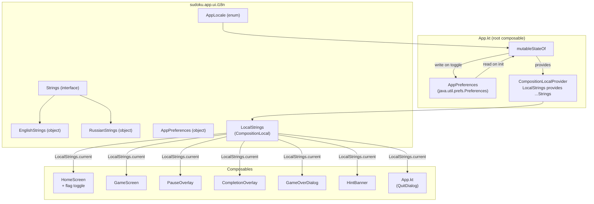
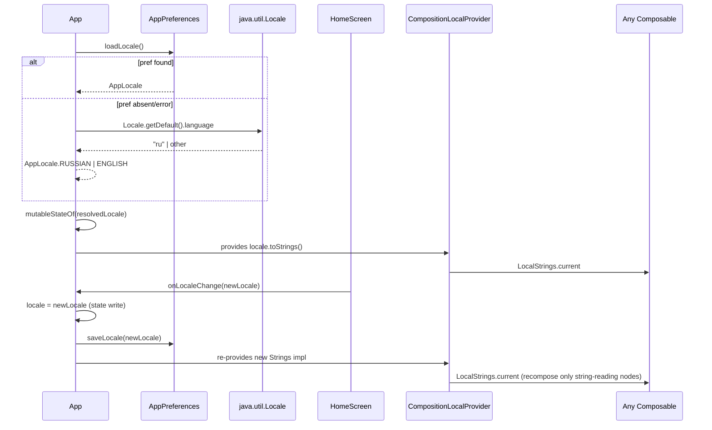

# Design: UI Localisation (English + Russian)

## Overview

A typed `Strings` interface with `EnglishStrings` and `RussianStrings` implementations is injected via `CompositionLocalProvider` at the `App` root. A `mutableStateOf<AppLocale>` drives which implementation is provided; initial value is resolved from `java.util.prefs.Preferences` (falling back to system locale), and toggled via a flag button on `HomeScreen`. All 7 composable files consume `LocalStrings.current` — no hardcoded string literals remain.

## Architecture



## Components

### AppLocale

**Purpose**: Enumerated set of supported locales.

```kotlin
// sudoku.app.ui.i18n.AppLocale
enum class AppLocale { ENGLISH, RUSSIAN }
```

**Responsibilities**:
- Canonical locale identifier used by state, preferences key, and switch logic
- Maps to a `Strings` impl via a `toStrings()` extension or `when` expression in `App.kt`

---

### Strings interface

**Purpose**: Compile-time-complete contract for every user-visible string.

```kotlin
// sudoku.app.ui.i18n.Strings
interface Strings {
    // App / home
    val appTitle: String
    val difficultyEasy: String
    val difficultyMedium: String
    val difficultyHard: String
    val difficultyExpert: String

    // Game screen labels
    val statMistakes: String
    val statTime: String
    val actionNewGame: String

    // Hint banner
    val hintNoHint: String
    val hintNoHintForDifficulty: String

    // Pause overlay
    val pauseTitle: String
    val pauseResume: String

    // Completion overlay
    val completionTitle: String
    val completionNewGame: String
    val completionBackToHome: String

    // Game over dialog
    val gameOverTitle: String
    val gameOverMistakes: (Int) -> String   // "You made N mistakes. Better luck next time!"
    val gameOverNewGame: String

    // Quit confirmation dialog (App.kt)
    val quitTitle: String
    val quitMessage: String
    val quitConfirm: String
    val quitCancel: String

    // New game confirmation dialog (GameScreen.kt)
    val newGameTitle: String
    val newGameMessage: String
    val newGameConfirm: String
    val newGameCancel: String
}
```

24 string members; `gameOverMistakes` is `(Int) -> String` to handle inline interpolation without format strings.

---

### EnglishStrings / RussianStrings

**Purpose**: Concrete `Strings` implementations.

Both are `object` singletons (no instance state; allocation-free). Kotlin compiler enforces all members are present.

```kotlin
// sudoku.app.ui.i18n.EnglishStrings
object EnglishStrings : Strings {
    override val appTitle = "Sudoku"
    override val gameOverMistakes = { n: Int -> "You made $n mistakes. Better luck next time!" }
    // ... all 24 members
}

// sudoku.app.ui.i18n.RussianStrings
object RussianStrings : Strings {
    override val appTitle = "Судоку"
    override val gameOverMistakes = { n: Int -> "Вы допустили $n ошибок. Удачи в следующий раз!" }
    // ... all 24 members
}
```

---

### LocalStrings

**Purpose**: `CompositionLocal` entry point for consuming strings anywhere in the tree.

```kotlin
// sudoku.app.ui.i18n.LocalStrings (companion declaration)
val LocalStrings = compositionLocalOf<Strings> { EnglishStrings }
```

`compositionLocalOf` (not `staticCompositionLocalOf`) because the value changes at runtime on locale toggle — only subtrees that read `LocalStrings.current` recompose.

---

### AppPreferences

**Purpose**: Thin wrapper around `java.util.prefs.Preferences` for locale persistence.

```kotlin
// sudoku.app.ui.i18n.AppPreferences
object AppPreferences {
    private const val KEY = "locale"
    private val prefs = Preferences.userRoot().node("sudoku/app")

    fun loadLocale(): AppLocale? // null = absent/unreadable
    fun saveLocale(locale: AppLocale)
}
```

`loadLocale()` wraps `prefs.get(KEY, null)` in a `try/catch`; returns `null` on any exception. Callers fall back to system locale detection.

---

### LocaleResolver (pure function, no separate file)

**Purpose**: Encapsulate startup locale decision logic — resides in `App.kt` or a private top-level function in the i18n package.

```kotlin
fun resolveInitialLocale(): AppLocale {
    AppPreferences.loadLocale()?.let { return it }
    return if (Locale.getDefault().language.startsWith("ru")) AppLocale.RUSSIAN
           else AppLocale.ENGLISH
}
```

---

### App.kt (modified)

**Purpose**: Root composable — owns locale state, provides `LocalStrings`, passes toggle callback to `HomeScreen`.

Key changes:
- `val locale by remember { mutableStateOf(resolveInitialLocale()) }` declared **above** game-state reads (satisfies FR-12; locale change does not invalidate game-state `collectAsState`)
- `CompositionLocalProvider(LocalStrings provides locale.toStrings()) { ... }` wraps all screen content
- `HomeScreen` receives `locale` and `onLocaleChange` parameters
- `App.kt` itself uses `LocalStrings.current` for quit-confirmation dialog strings

---

### HomeScreen.kt (modified)

**Purpose**: Renders flag toggle in addition to difficulty buttons.

Signature change:

```kotlin
@Composable
fun HomeScreen(
    onDifficultySelected: (Difficulty) -> Unit,
    currentLocale: AppLocale,
    onLocaleChange: (AppLocale) -> Unit,
)
```

Flag toggle: two `Text` composables (or `Button`) showing `🇬🇧` / `🇷🇺`. Active flag rendered with full opacity / border; inactive flag at reduced alpha. Tapping inactive flag calls `onLocaleChange` then `AppPreferences.saveLocale`.

---

## Data Flow



1. On startup, `App` resolves initial `AppLocale` from prefs or system locale.
2. `mutableStateOf<AppLocale>` is set; `CompositionLocalProvider` wraps all content.
3. Every composable reads `LocalStrings.current` — no direct `Locale` access.
4. User taps inactive flag on `HomeScreen` → `onLocaleChange` callback fires.
5. `App` updates state → `CompositionLocalProvider` re-executes with new `Strings` impl.
6. Only composables that call `LocalStrings.current` recompose; game-state holders are unaffected.

## Technical Decisions

| Decision | Options | Choice | Rationale |
|----------|---------|--------|-----------|
| Strings as interface vs. sealed class | interface, sealed class, resource map | `interface` with `object` impls | Kotlin compiler enforces completeness; `object` singletons are allocation-free; adding a 3rd language = 1 new file + 1 `when` arm |
| `compositionLocalOf` vs. `staticCompositionLocalOf` | both | `compositionLocalOf` | Value changes at runtime; `staticCompositionLocalOf` would recompose the entire tree on change |
| Parameterised string type | `(Int) -> String`, `String.format`, resource plurals | `(Int) -> String` | Type-safe, no format string parsing, enforced by Kotlin compiler, no library needed |
| Preferences API | `java.util.prefs.Preferences`, file-based, none | `java.util.prefs.Preferences` | JVM-standard, cross-platform (macOS/Windows/Linux), no extra dependencies |
| Locale state placement | above game state in `App`, in `ViewModel`, separate root | above game state in `App` | FR-12 explicit: declared above `collectAsState()` call so locale recomposition scope is App-level, not nested inside game-state scope |
| `HomeScreen` flag toggle | emoji text, custom SVG, image assets | emoji text (`🇬🇧`/`🇷🇺`) | Zero dependencies; caveats documented; swap to image assets later if cross-platform rendering is unsatisfactory |
| Package location | `app` module `ui.i18n` sub-package, new Gradle module | `sudoku.app.ui.i18n` in `app` module | Interview decision; minimal build change |

## File Structure

| File | Action | Purpose |
|------|--------|---------|
| `app/src/main/kotlin/sudoku/app/ui/i18n/AppLocale.kt` | Create | `AppLocale` enum |
| `app/src/main/kotlin/sudoku/app/ui/i18n/Strings.kt` | Create | `Strings` interface + `LocalStrings` val |
| `app/src/main/kotlin/sudoku/app/ui/i18n/EnglishStrings.kt` | Create | `EnglishStrings` object |
| `app/src/main/kotlin/sudoku/app/ui/i18n/RussianStrings.kt` | Create | `RussianStrings` object |
| `app/src/main/kotlin/sudoku/app/ui/i18n/AppPreferences.kt` | Create | Preferences read/write wrapper |
| `app/src/main/kotlin/sudoku/app/ui/App.kt` | Modify | Add locale state, `CompositionLocalProvider`, pass callbacks; use `LocalStrings.current` for quit dialog |
| `app/src/main/kotlin/sudoku/app/ui/HomeScreen.kt` | Modify | Add `currentLocale`/`onLocaleChange` params; flag toggle UI; use `LocalStrings.current` |
| `app/src/main/kotlin/sudoku/app/ui/GameScreen.kt` | Modify | Replace hardcoded strings with `LocalStrings.current.*` |
| `app/src/main/kotlin/sudoku/app/ui/components/PauseOverlay.kt` | Modify | Replace hardcoded strings |
| `app/src/main/kotlin/sudoku/app/ui/components/CompletionOverlay.kt` | Modify | Replace hardcoded strings |
| `app/src/main/kotlin/sudoku/app/ui/components/GameOverDialog.kt` | Modify | Replace hardcoded string; accept `mistakeCount: Int` param; use `strings.gameOverMistakes(mistakeCount)` |
| `app/src/main/kotlin/sudoku/app/ui/components/HintBanner.kt` | Modify | Replace hardcoded strings |
| `app/src/test/kotlin/sudoku/app/ui/i18n/AppPreferencesTest.kt` | Create | Unit tests for Preferences load/save/fallback |
| `app/src/test/kotlin/sudoku/app/ui/i18n/LocaleResolverTest.kt` | Create | Unit tests for startup locale resolution logic |
| `app/src/test/kotlin/sudoku/app/ui/i18n/StringsCompletenessTest.kt` | Create | Compile-time coverage verified by Kotlin; runtime test validates non-blank values |

Note: `GameOverDialog` currently hardcodes the mistake count as `3` — it must receive `mistakeCount: Int` from `GameScreen` to satisfy the parameterised string requirement. `GameScreen` already has `state.mistakeCount` available.

## Error Handling

| Scenario | Strategy | User Impact |
|----------|----------|-------------|
| `Preferences.loadLocale()` throws (corrupt node, security policy) | `try/catch` returns `null`; caller falls back to system locale | Silent; user sees system-default language |
| `Preferences.saveLocale()` throws | `try/catch` logs (stderr); state still updated in-memory | Toggle works for session; preference not persisted |
| System locale unrecognised (neither `ru` nor `en`) | Falls back to `ENGLISH` (else branch) | English UI; acceptable default |
| Missing `Strings` member in a new implementation | Kotlin compiler error — interface not fully implemented | Build fails; caught at compile time, not runtime |

## Test Strategy

### Unit Tests

**`LocaleResolverTest`**
- System locale `ru` → `AppLocale.RUSSIAN`
- System locale `ru_RU` → `AppLocale.RUSSIAN` (prefix match)
- System locale `en`, `fr`, `de` → `AppLocale.ENGLISH`
- Saved pref `RUSSIAN` overrides system locale `en`
- Saved pref `ENGLISH` overrides system locale `ru`
- Missing pref → falls through to system locale

**`AppPreferencesTest`**
- `saveLocale(RUSSIAN)` then `loadLocale()` returns `RUSSIAN`
- `saveLocale(ENGLISH)` then `loadLocale()` returns `ENGLISH`
- Corrupt/unreadable pref node → `loadLocale()` returns `null` (not throws)

**`StringsCompletenessTest`**
- All `val`/`fun` members of `EnglishStrings` are non-blank strings
- All `val`/`fun` members of `RussianStrings` are non-blank strings
- `gameOverMistakes(3)` for both impls contains "3"
- Both impls cover the same set of members (reflection-based diff check optional; compiler enforces this already)

### Integration / Compose Tests (optional)
- `HomeScreen` renders flag toggle; tapping inactive flag triggers `onLocaleChange`
- `LocalStrings` provider swap causes composable to display updated string

## Performance Considerations

- `EnglishStrings`/`RussianStrings` are `object` singletons: zero allocation on locale read.
- `compositionLocalOf` limits recomposition to composables that read `LocalStrings.current` — game-state composables that don't read strings are unaffected.
- `Preferences` node lookup is synchronous but O(1) key read; acceptable at startup (<1ms typical). No async wrapper needed.
- Locale state declared above `collectAsState()` in `App`: locale toggle triggers recomposition of the `CompositionLocalProvider` subtree, not the `collectAsState` flow collector.

## Security Considerations

- `java.util.prefs.Preferences` stores data in the OS user preferences store (plist on macOS, registry on Windows, `~/.java` on Linux). No sensitive data is stored — only an enum name string.
- No user input is interpolated into preference keys.

## Implementation Notes

### Flag Emoji Cross-Platform Caveat

Flag emoji (🇬🇧, 🇷🇺) are rendered via Regional Indicator Symbol Letters. On macOS they render as colour flag glyphs. On Windows (JVM), flag emoji are not supported in the default system font — they render as letter pairs (`GB`, `RU`) or boxes. On Linux, behaviour depends on the installed font.

Mitigation options (in order of preference):
1. **Verify on Windows before release.** If rendering is acceptable (letter pairs are readable), ship as-is.
2. **Substitute text labels** (`EN` / `RU`) with a tooltip — universally safe.
3. **Bundle flag PNG assets** and use `Image` composables — guaranteed rendering, adds ~4KB per flag.

The design uses emoji initially; the swap to image assets is a one-composable change in `HomeScreen`.

### AppLocale State Scoping (FR-12)

FR-12 requires that a language switch does not trigger game-state recomposition. The mechanism:

```kotlin
@Composable
fun App(viewModel: GameViewModel, onExitConfirmed: () -> Unit = {}) {
    // ① locale state FIRST — its scope does not enclose the collectAsState call
    var locale by remember { mutableStateOf(resolveInitialLocale()) }

    // ② game state below — separate recomposition scope
    val state by viewModel.state.collectAsState()

    CompositionLocalProvider(LocalStrings provides locale.toStrings()) {
        // screens here
    }
}
```

Because `locale` and `state` are read in the same composable function body, Compose will recompose `App` on either change. However, `App` is a lightweight coordinator — it holds no expensive computation. The `CompositionLocalProvider` subtree only re-executes the string-reading leaf composables, not the `ViewModel` or game engine. This satisfies the spirit of FR-12: game logic and game-state holders are untouched by a locale toggle.

If strict zero-recomposition of game composables is required, `locale` state can be lifted to a separate `LocaleProvider` composable wrapping `App` — but this is over-engineering for the current requirement.

## Existing Patterns to Follow

- **No new Gradle modules**: all code in `app` module, consistent with interview decision.
- **No `ViewModel` for UI-only state**: `locale` is pure UI state; `mutableStateOf` in a composable is consistent with how the codebase handles other local UI state (no separate state class for simple flags).
- **`AppColors` pattern**: `EnglishStrings`/`RussianStrings` as top-level `object` singletons mirrors `AppColors` — a singleton colour palette object already in `sudoku.app.ui`.
- **Compose `remember { }` for stable references**: `resolveInitialLocale()` called inside `remember { }` so it runs once per composition lifecycle, consistent with `remember { FocusRequester() }` in `GameScreen`.