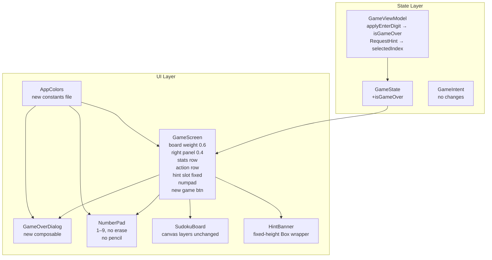
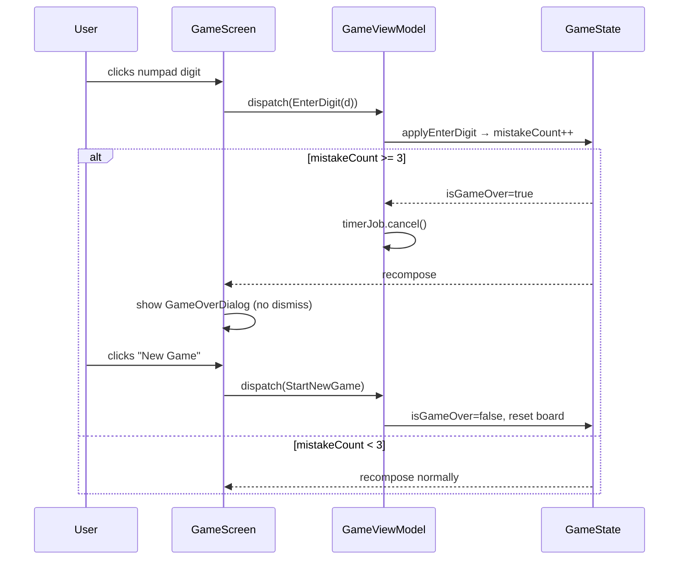

# Design: UI Redesign

## Overview

Extend the existing Compose Desktop app in-place: add `isGameOver` to `GameState`, wire 3-mistake game-over logic into `applyEnterDigit`, add a `GameOverDialog` composable, replace the conditional `HintBanner` with a fixed-height hint slot, remove the pencil button, and update `RequestHint` to also set `selectedIndex`. All color literals are consolidated into a new `AppColors` object.

## Architecture



## Components

### AppColors (new)
**Purpose**: Single source of truth for brand colors.

```kotlin
object AppColors {
    val Primary       = Color(0xFF3D5A9A)   // board thick lines, action button icons
    val NewGameBtn    = Color(0xFF5B71B9)   // New Game button bg
    val Highlight     = Color(0xFFD4E8FA)   // row/col/box canvas layer
    val Background    = Color(0xFFF0F5FF)   // window background
    val StatLabel     = Color(0xFF7A8FAA)
    val StatValue     = Color(0xFF1A3060)
    val ActionBtnBg   = Color(0xFFE4ECF7)   // enabled circular button bg
    val ActionBtnDis  = Color(0xFFF0F0F0)   // disabled
    val PauseBtnBg    = Color(0xFFE0E8F4)
    val NumBtnBg      = Color(0xFFDDE8F5)
    val NumBtnDis     = Color(0xFFEEEEEE)
    val GivenDigit    = Color(0xFF1A3060)
    val EnteredDigit  = Color(0xFF3D6AB0)
    val HintSlotBg    = Color(0xFFF0F5FF)   // same as window bg (invisible placeholder)
}
```

### GameState (modify)

Add `isGameOver: Boolean` field. No sealed class — single flag keeps diff minimal.

```kotlin
data class GameState(
    // … existing fields …
    val isGameOver: Boolean,   // NEW: true when mistakeCount reaches 3
)
```

`Initial` companion: `isGameOver = false`.  
`equals` override: add `isGameOver == other.isGameOver`.

### GameViewModel (modify)

Two changes:

**`applyEnterDigit`** — after computing `newState`, set `isGameOver = true` when `newState.mistakeCount >= 3`. Stop the timer on game-over (via a side-effect or inline). Also stop `checkCompletion` from running when already game-over.

```kotlin
private fun applyEnterDigit(state: GameState, digit: Int): GameState {
    // … existing logic …
    val withMistake = state.copy(
        digits = newDigits,
        conflictIndices = conflicts,
        undoStack = newUndo,
        redoStack = emptyList(),
        numberHighlightDigit = null,
        hintResult = null,
        mistakeCount = newMistakeCount,
        isGameOver = newMistakeCount >= 3,
    )
    return if (withMistake.isGameOver) withMistake else checkCompletion(withMistake)
}
```

**`handleSideEffects`** — add case for `GameCompleted` already cancels timer; add game-over timer stop. Since `isGameOver` is set inline in reduce (not a separate intent), cancel the timer in `handleSideEffects` after checking `_state.value.isGameOver`.

Simpler approach: after `_state.update` in `dispatch`, check `_state.value.isGameOver && timerJob?.isActive == true` and cancel.

```kotlin
fun dispatch(intent: GameIntent) {
    _state.update { current -> reduce(current, intent) }
    handleSideEffects(intent)
    if (_state.value.isGameOver) timerJob?.cancel()
}
```

**`RequestHint` reducer** — also set `selectedIndex` to the hinted cell index when hint is `HintResult.Found`:

```kotlin
is GameIntent.RequestHint -> {
    val board = Board.fromDigits(state.digits, state.givens)
    val hint = HintEngine.findHint(board, state.difficulty)
    val hintIndex = if (hint is HintResult.Found) hint.index else null  // check actual HintResult.Found field
    state.copy(
        hintResult = hint,
        numberHighlightDigit = null,
        hintsRemaining = maxOf(0, state.hintsRemaining - 1),
        selectedIndex = hintIndex ?: state.selectedIndex,
    )
}
```

> **Note**: Verify the actual field name on `HintResult.Found` that exposes the target cell index — check `sudoku.engine.HintResult` source. If it is not `index`, adjust accordingly.

**`PuzzleGenerated` reducer** — already resets `mistakeCount = 0` and `hintsRemaining = 3`; add `isGameOver = false`.

**`TimerTick` reducer** — add `!state.isGameOver` guard:
```kotlin
is GameIntent.TimerTick -> if (!state.isPaused && !state.isComplete && !state.isGameOver && !state.isLoading)
    state.copy(timerSeconds = state.timerSeconds + 1)
else state
```

### GameIntent (no changes)

No new intents. Game-over is triggered internally from `applyEnterDigit`. New Game exits game-over via the existing `StartNewGame` intent.

### GameScreen (modify)

Key changes:

1. **Board weight**: change `weight(0.58f)` → `weight(0.6f)`, right panel `weight(0.42f)` → `weight(0.4f)`.
2. **Stats row**: reorder to timer first (with pause toggle), then mistake count `${state.mistakeCount}/3`.
3. **Action row**: remove `BadgedActionButton` for pencil/notes (✏ OFF). Keep Undo, Erase, Hints. Erase disabled when `selectedIndex == null || givens[selectedIndex]`.
4. **Hint slot**: replace conditional `if (state.hintResult != null) { HintBanner(...) }` with fixed-height Box always occupying space:
   ```kotlin
   Box(modifier = Modifier.fillMaxWidth().height(56.dp)) {
       if (state.hintResult != null) {
           HintBanner(hintResult = state.hintResult)
       }
   }
   ```
5. **NumberPad `enabled`**: add `&& !state.isGameOver`.
6. **Action buttons `enabled`**: add `&& !state.isGameOver` to Undo, Erase, and Hints guards.
7. **GameOverDialog**: show when `state.isGameOver`:
   ```kotlin
   if (state.isGameOver) {
       GameOverDialog(onNewGame = { onIntent(GameIntent.StartNewGame(state.difficulty)) })
   }
   ```
8. **Keyboard handler**: add `state.isGameOver` guard — all input intents (digits, arrow keys, erase, undo, hint) return `false` when game-over.
9. Use `AppColors` constants everywhere instead of inline hex literals.

### GameOverDialog (new composable)

Location: `app/src/main/kotlin/sudoku/app/ui/components/GameOverDialog.kt`

```kotlin
@Composable
fun GameOverDialog(onNewGame: () -> Unit) {
    AlertDialog(
        onDismissRequest = {},           // no dismiss — only New Game exits
        title = { Text("Game Over") },
        text  = { Text("You made 3 mistakes. Better luck next time!") },
        confirmButton = {
            Button(
                onClick = onNewGame,
                colors = ButtonDefaults.buttonColors(
                    backgroundColor = AppColors.NewGameBtn,
                    contentColor = Color.White,
                ),
            ) { Text("New Game") }
        },
        dismissButton = null,
    )
}
```

`onDismissRequest = {}` (empty lambda) prevents Escape/click-outside from dismissing.

### NumberPad (modify)

Remove the `Modifier.weight(1f).aspectRatio(1f)` note — it is already `weight(1f)` on `modifier` passed to `NumberButton`. Currently `aspectRatio(1f)` is inside `NumberButton` applied to `Surface`. This is correct; no change needed for layout.

Only change: pass `AppColors` colors instead of inline hex. No structural change.

### SudokuBoard (no change)

Canvas layers are already correct:
1. Base bg `0xFFF8FBFF`
2. Row/col/box highlight `0xFFD4E8FA` = `AppColors.Highlight` ✓
3. Number-match overlay `0xFFFFF3CD`
4. Selected overlay `0xFFBBD4F0`
5. Conflict overlay `0xFFFFCCCC`
6. Grid lines (via `drawGrid`)
7. Border rings (via `drawBorders`)

Optional: import `AppColors` for the highlight and primary grid color constants.

### HintBanner (no change)

The component itself is unchanged. The caller (`GameScreen`) wraps it in a fixed-height Box.

## State Changes Summary

| Field | Type | Change | Default |
|-------|------|--------|---------|
| `isGameOver` | `Boolean` | ADD | `false` |

No new intents. No new reducers.

## Data Flow



## Technical Decisions

| Decision | Options | Choice | Rationale |
|----------|---------|--------|-----------|
| Game-over model | sealed class vs Boolean flag | `isGameOver: Boolean` | Minimal diff; no new intents or dispatch paths needed |
| Game-over timer stop | New intent vs inline cancel | Inline `timerJob.cancel()` after `dispatch()` checks `_state.value.isGameOver` | Avoids adding `GameOver` intent; consistent with how `GameCompleted` works |
| Hint slot height | Dynamic vs fixed | `56.dp` fixed | Prevents layout shift when hint appears/disappears; FR-15 requirement |
| Color constants location | Per-file vs shared object | New `AppColors.kt` in `sudoku.app.ui` package | Single source; avoids scattered hex literals across 4+ files |
| `RequestHint` → `selectedIndex` | New intent vs inline | Inline in existing reducer | No new intent needed; simpler state machine |
| Pencil button removal | Disable (OFF badge) vs remove | Remove entirely | FR-8 explicitly requires removal; saves horizontal space for 3 buttons |
| GameOverDialog dismiss | Dismissible vs non-dismissible | `onDismissRequest = {}` | US-3 requires no dismiss path; only New Game exits game-over |
| Canvas layers | Reorder vs keep | Keep existing order | Already correct per research.md; no regression |
| `weight` + `aspectRatio` in NumberPad | LazyGrid vs nested Column+Row | Keep nested Column+Row | Research confirms LazyGrid crashes in scrollable parent |

## File Structure

| File | Action | Changes |
|------|--------|---------|
| `app/src/main/kotlin/sudoku/app/ui/AppColors.kt` | Create | Brand color constants object |
| `app/src/main/kotlin/sudoku/app/ui/components/GameOverDialog.kt` | Create | Non-dismissible game-over dialog |
| `app/src/main/kotlin/sudoku/app/state/GameState.kt` | Modify | Add `isGameOver: Boolean`; update `Initial`, `equals` |
| `app/src/main/kotlin/sudoku/app/state/GameViewModel.kt` | Modify | `applyEnterDigit` sets `isGameOver`; `dispatch` cancels timer; `RequestHint` sets `selectedIndex`; `TimerTick` guards `isGameOver`; `PuzzleGenerated` resets `isGameOver=false` |
| `app/src/main/kotlin/sudoku/app/ui/GameScreen.kt` | Modify | Weights, stats order, remove pencil button, fixed hint slot, game-over guard on actions/keyboard, show `GameOverDialog`, use `AppColors` |
| `app/src/main/kotlin/sudoku/app/ui/components/NumberPad.kt` | Modify | Use `AppColors`; no structural change |
| `app/src/main/kotlin/sudoku/app/ui/components/SudokuBoard.kt` | Modify (optional) | Use `AppColors` for highlight/grid colors |
| `app/src/main/kotlin/sudoku/app/ui/components/HintBanner.kt` | No change | Caller wraps in fixed Box |

## Error Handling

| Scenario | Handling | User Impact |
|----------|----------|-------------|
| `HintResult.Found` has no cell index field | Fall back to `selectedIndex = state.selectedIndex` (no selection change) | Hint text shown, no cell selected — acceptable degradation |
| `RequestHint` when `hintsRemaining == 0` | Button disabled (`enabled = hintsRemaining > 0`) | Button is greyed; no dispatch |
| `StartNewGame` during game-over | `PuzzleGenerated` reducer resets `isGameOver = false` | Board resets cleanly |
| Key events during game-over | `handleKeyEvent` returns `false` for all input keys when `state.isGameOver` | Keyboard silently ignored |

## Edge Cases

- **Mistake on last cell**: `isGameOver = true` set before `checkCompletion` runs — game-over takes priority over completion.
- **Undo after game-over**: Dialog blocks UI; undo button disabled (`!state.isGameOver`). Keyboard handler also blocks Ctrl+Z.
- **Hint with no target cell**: `HintResult.NoHint` / `HintResult.NoHintForDifficulty` have no index — `selectedIndex` stays unchanged.
- **Pause during game-over**: Timer already stopped; pause button not guarded for game-over (acceptable, no timer to pause).
- **Fixed hint slot when loading**: `state.hintResult` is `null` during loading — Box shows empty, no height thrash.

## Test Strategy

### Unit Tests (GameViewModel)
- `applyEnterDigit` with 3rd wrong digit → `isGameOver == true`
- `applyEnterDigit` with 3rd wrong digit → `checkCompletion` not called
- `TimerTick` when `isGameOver == true` → state unchanged
- `PuzzleGenerated` → `isGameOver == false`
- `RequestHint` when `HintResult.Found` → `selectedIndex` updated to hint cell

### Manual / Visual Tests
- Enter 3 wrong digits → GameOverDialog appears, board not interactive
- Click outside GameOverDialog → dialog stays (no dismiss)
- Click "New Game" in GameOverDialog → board resets, `isGameOver = false`
- Hint button → hinted cell selected on board
- Fixed hint slot height: verify no layout shift when hint appears/disappears
- Erase button disabled when: no selection, or selected cell is a given
- 3×3 numpad square aspect ratio preserved at various window sizes

### Build Verification
```
./gradlew :engine:test
./gradlew :app:build
./gradlew :app:run
```

## Open Questions

1. **`HintResult.Found` cell index field name**: The reducer needs to access the target cell index from `HintResult.Found`. Verify the exact property name in `sudoku.engine.HintResult` — if no such field exists, the "select hinted cell" feature (FR-7) may require an engine change or must be omitted.

2. **Hint slot height `56.dp`**: Chosen to fit one line of hint text plus padding. If `HintBanner` can wrap to two lines, increase to `72.dp`.

3. **Stats row order**: Design shows timer left, mistakes right (matching current code). Requirements US-2 says "MM:SS timer + X/3 mistake count" — this order (timer first). Confirm with product if order matters.

## Implementation Order

Recommended sequence to avoid broken intermediate states:

1. Create `AppColors.kt` — no dependencies, unblocks color usage everywhere
2. Modify `GameState.kt` — add `isGameOver`; fixes compile errors in step 3+
3. Modify `GameViewModel.kt` — `applyEnterDigit`, `TimerTick`, `RequestHint`, `PuzzleGenerated`
4. Create `GameOverDialog.kt` — standalone composable, no dependencies on other UI changes
5. Modify `GameScreen.kt` — remove pencil button, weights, fixed hint slot, `GameOverDialog`, keyboard guard, `AppColors`
6. Modify `NumberPad.kt` — `AppColors` only (cosmetic, safe last)
7. Run `./gradlew :app:build` — fix any remaining compile errors
8. Run `./gradlew :app:run` — manual visual verification
